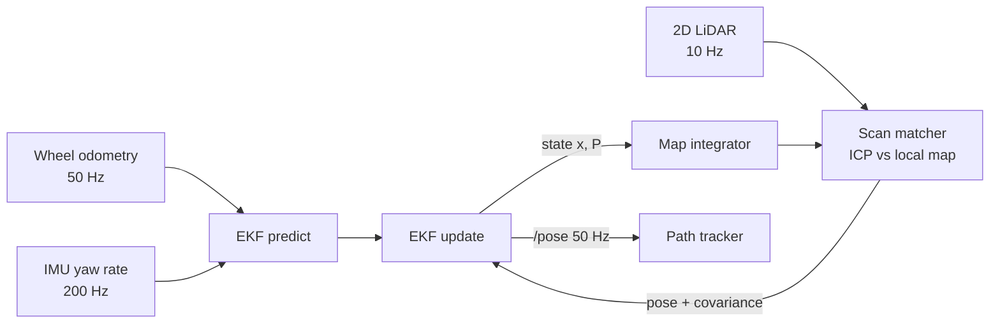

# 06. Robotics-specific

None of this chapter is on LeetCode. It is the set of small robotics tools that a mobile robot
runs every fraction of a second: guessing where it is from a noisy sensor (a Kalman filter),
holding a speed or a heading (a PID controller), turning "the camera saw a cup here" into "the
cup is there in the room" (transforms), and finding a wall in a cloud of laser points (line
fitting and RANSAC). Each of the four is a concept *and* a working C++ file you can put in a
public repo. Part B has two LeetCode problems that are literally about robots. Part C turns the
work into a portfolio. Rough time: 5 days at about 2 hours a day.

**What you need before this chapter:** classes, `std::vector`, `struct` and references from
chapter 01; DFS and BFS on a grid from chapter 03 (Part B uses both); Dijkstra from chapter 04
(The Maze II is Dijkstra). A tiny bit of secondary-school maths: sine, cosine, and what a mean
and a variance are (a variance is "how spread out", a small number means "quite sure").

Compile the plain files with `g++ -std=c++17 -Wall -Wextra -O2 file.cpp -o x && ./x`. The two
Eigen files (`01b` and `03`) also need `-isystem /usr/include/eigen3` so the compiler can find
the Eigen headers.

---

## Part A — Implement from scratch

Each item below is a story first, then the maths with real numbers, then a hand trace, then the
Python you would have written, then the C++ file with every new symbol explained.

### b1. 1D Kalman filter in C++

**The story.** A robot is driving down a corridor. Two voices tell it where it is:

- *Its own dead reckoning* says "I think I am at 10 m, but I am not very sure, give or take 2 m."
- *A range sensor* says "you are at 12 m, give or take 1 m."

Which one do you believe? Neither, fully. You blend them, and you lean toward the one that is
more sure. The sensor is twice as precise, so the answer should be closer to 12 than to 10.
And here is the surprising part: after combining two opinions you are *more sure than either
one alone*, because two independent measurements are better than one.

```
     belief before:            sensor:                 belief after:
  "about 10, give or take 2"  "about 12, give or take 1"  "about 11.6, give or take 0.9"

  ------(======10======)------         wide bell: not sure
  ----------------(==12==)---          narrower bell: fairly sure
  ---------------(=11.6=)----          narrowest bell: the blend is surest of all
```

**Doing the blend with actual numbers.** "Give or take 2 m" is a standard deviation of 2, so a
*variance* (standard deviation squared) of 4. The sensor's variance is 1. The rule is:

```
gain      K = (my variance) / (my variance + sensor variance)
          K = 4 / (4 + 1) = 0.8

estimate  x = my guess + K * (sensor - my guess)
          x = 10 + 0.8 * (12 - 10) = 10 + 1.6 = 11.6

variance  P = (1 - K) * my variance
          P = 0.2 * 4 = 0.8
```

Read the gain `K = 0.8` as "believe 80 % of the sensor's correction". The sensor was 4 times
more certain (variance 1 against 4), so it gets 4 parts out of 5. The new variance 0.8 is
smaller than both 4 and 1: you are now surer than either voice on its own.

Try it with the numbers swapped: if *my* variance were 1 and the sensor's 4, `K = 1/5 = 0.2`,
`x = 10 + 0.2 * 2 = 10.4`, close to my own guess. Same formula, opposite lean.

In C++ that whole blend is five lines:

```cpp
double x = 10.0, P = 4.0;     // my belief: about 10, variance 4
double z = 12.0, R = 1.0;     // the sensor: says 12, variance 1
double K = P / (P + R);       // 0.8
x = x + K * (z - x);          // 11.6
P = (1.0 - K) * P;            // 0.8
```

**The pieces, named.** A Kalman filter is just that blend, repeated every time step, with one
extra step in between:

1. **Predict.** The robot moves. You shift your guess by how far you think you moved, and you
   become *less* sure, because wheels slip and the motor is not perfect. Variance goes up.
2. **Update.** The sensor reports. You blend (the five lines above) and become *more* sure.
   Variance goes down.
3. **The gain `K`** is the dial between the two, recomputed every update from the two variances.
   It is never a number you tune by hand.

Two names you will hear: `Q` is the variance you *add* in each predict, "how much can my motion
model be wrong per second". `R` is the sensor's variance, "how noisy is my sensor". Together with
the estimate `x` and its variance `P`, that is the whole filter.

**The scalar equations**, each line matched to the story. State is position `x`, the control
`u` is the commanded velocity, `dt` is the time step:

```
Predict:   x = x + u * dt          I moved by roughly u*dt
           P = P + Q * dt          ...and I am less sure than before

Update:    y = z - x               the surprise: what the sensor said minus what I expected
           S = P + R               how big a surprise is normal (my doubt + the sensor's noise)
           K = P / S               the gain: how much of the surprise to believe, 0 to 1
           x = x + K * y           move toward the sensor by that fraction
           P = (1 - K) * P         ...and I am more sure than before
```

`y` is called the *innovation*. If it is much bigger than `sqrt(S)` for many steps in a row,
something is wrong: the sensor is broken or `Q`/`R` are set badly.

**A 3-step hand trace.** Start at `x = 0`, `P = 1`. Commanded speed `u = 1` m/s, `dt = 1` s,
`Q = 1`, `R = 1`. The sensor reads 1.4, then 2.6, then 2.9.

| step | predict: x, P | sensor z | surprise y | gain K | after update: x, P |
|---|---|---|---|---|---|
| 1 | 1.000, 2.000 | 1.4 | +0.400 | 2/3 = 0.667 | 1.267, 0.667 |
| 2 | 2.267, 1.667 | 2.6 | +0.333 | 0.625 | 2.475, 0.625 |
| 3 | 3.475, 1.625 | 2.9 | -0.575 | 0.619 | 3.119, 0.619 |

Check step 1 by hand: predict gives `x = 0 + 1 = 1`, `P = 1 + 1 = 2`. Surprise `y = 1.4 - 1 =
0.4`. `S = 2 + 1 = 3`, `K = 2/3`. `x = 1 + 0.667 * 0.4 = 1.267`. `P = (1 - 0.667) * 2 = 0.667`.
Notice how `P` rises in every predict (2.0, 1.667, 1.625) and falls in every update, and how it
settles: with `Q = R = 1` the after-update variance heads to 0.618 and stays there. `K` settles
too. In a running filter both stop changing after a few dozen steps.

**What `Q` and `R` mean in plain words.** `R` is "how much I trust my sensor" (small `R`, big
trust). `Q` is "how much I trust my motion model" (small `Q`, big trust). You measure `R`: hold
the sensor still, record for a minute, take the variance. You tune `Q`: it stands for wheel
slip, a wrong wheel diameter, bumps in the floor.

- *What if `R` is tiny?* `K = P / (P + R)` goes to 1. The estimate jumps straight to every
  measurement; the filter is just copying the sensor. `P` collapses to almost 0 after each
  update.
- *What if `Q` is huge?* `P` inflates in every predict, so `K` stays near 1 and again you are
  copying the sensor, one step late. No smoothing.
- *What if `Q` is tiny?* `P` shrinks and shrinks, `K` goes to 0, and the filter stops listening
  to the sensor. If the robot then actually gets bumped, the filter never notices: "the filter
  fell asleep". This is the most common real bug.
- *Start with a big `P`.* "I do not know where I am" is a large `P0`, which makes the first few
  gains close to 1 so the filter locks onto the sensor quickly. `P0 = 0` means "I am certain",
  and the filter will never believe a measurement.

**The demo file.** The scalar version, tested: the two gain limits above, `P` shrinking on
update to exactly `P*R/(P+R)`, and a 500-step simulation with a fixed random seed where the
filtered error must be less than half the raw sensor error.

```cpp
// 1D (scalar-state) Kalman filter with a deterministic simulation.
// State x = position [m]. Control u = commanded velocity [m/s].
// Process model:      x_k = x_{k-1} + u*dt + w,   w ~ N(0, q*dt)
// Measurement model:  z_k = x_k + v,              v ~ N(0, r)
#include <cassert>
#include <cmath>
#include <iostream>
#include <random>
#include <vector>

class Kalman1D {
public:
    // x0/p0: initial estimate and its variance. q: process noise variance per second.
    // r: measurement noise variance.
    Kalman1D(double x0, double p0, double q, double r) : x_(x0), p_(p0), q_(q), r_(r) {}

    // Predict step: x' = A x + B u with A = 1, B = dt. P' = A P A^T + Q  (A = 1 here).
    void predict(double u, double dt) {
        x_ += u * dt;
        p_ += q_ * dt;                  // uncertainty only ever grows in predict
    }

    // Update step with z = H x + v, H = 1.
    void update(double z) {
        innovation_ = z - x_;           // y = z - H x  ("what the sensor says minus what I expected")
        const double s = p_ + r_;       // S = H P H^T + R, variance of the innovation
        gain_ = p_ / s;                 // K = P H^T S^-1, in [0,1]: 0 = trust model, 1 = trust sensor
        x_ += gain_ * innovation_;
        p_ = (1.0 - gain_) * p_;        // P = (I - K H) P, always <= previous P
    }

    double state() const { return x_; }
    double variance() const { return p_; }
    double gain() const { return gain_; }
    double innovation() const { return innovation_; }

private:
    double x_, p_, q_, r_;
    double gain_ = 0.0;
    double innovation_ = 0.0;
};

double rms(const std::vector<double>& errors) {
    double sum = 0.0;
    for (double e : errors) sum += e * e;
    return std::sqrt(sum / static_cast<double>(errors.size()));
}

int main() {
    // ---- gain limits: the two questions every interviewer asks ----
    {
        Kalman1D trustSensor(0.0, 1.0, 0.0, 1e-9);   // R -> 0
        trustSensor.update(5.0);
        assert(std::fabs(trustSensor.state() - 5.0) < 1e-6);   // K -> 1, estimate jumps to z
        assert(trustSensor.gain() > 0.999);

        Kalman1D trustModel(0.0, 1e-9, 0.0, 1.0);    // P -> 0 (or R huge)
        trustModel.update(5.0);
        assert(std::fabs(trustModel.state()) < 1e-6);          // K -> 0, measurement ignored
        assert(trustModel.gain() < 1e-6);
    }

    // ---- P shrinks on update, grows on predict ----
    {
        Kalman1D kf(0.0, 4.0, 0.5, 1.0);
        const double p0 = kf.variance();
        kf.update(0.3);
        const double p1 = kf.variance();
        assert(p1 < p0);
        assert(std::fabs(p1 - (4.0 * 1.0) / (4.0 + 1.0)) < 1e-12);   // P R / (P + R)
        kf.predict(0.0, 0.1);
        assert(kf.variance() > p1);
    }

    // ---- simulation: target moving at commanded velocity with process noise, noisy sensor ----
    {
        const double dt = 0.1, q = 0.01, r = 1.0;   // sensor sigma = 1 m, model drifts slowly
        std::mt19937 rng(42);                       // fixed seed: the test is reproducible
        std::normal_distribution<double> processNoise(0.0, std::sqrt(q * dt));
        std::normal_distribution<double> measNoise(0.0, std::sqrt(r));

        double xTrue = 0.0;
        Kalman1D kf(0.0, 1.0, q, r);
        std::vector<double> rawErr, filtErr;
        for (int k = 0; k < 500; ++k) {
            const double u = 1.0;                   // commanded 1 m/s
            xTrue += u * dt + processNoise(rng);
            const double z = xTrue + measNoise(rng);

            kf.predict(u, dt);
            kf.update(z);

            rawErr.push_back(z - xTrue);
            filtErr.push_back(kf.state() - xTrue);
        }
        const double rawRms = rms(rawErr), filtRms = rms(filtErr);
        std::cout << "raw RMS = " << rawRms << " m, filtered RMS = " << filtRms
                  << " m, steady-state P = " << kf.variance() << ", K = " << kf.gain() << "\n";
        assert(filtRms < 0.5 * rawRms);            // the filter must beat the sensor clearly
        assert(kf.variance() < r);                  // posterior tighter than one measurement
    }

    std::cout << "OK 01_kalman_1d.cpp\n";
    return 0;
}
```

What to look at:

- `class Kalman1D` keeps four doubles: `x_` and `p_` (the belief), `q_` and `r_` (the two trust
  settings). The trailing underscore is a common C++ habit for member variables.
- `Kalman1D(double x0, double p0, double q, double r) : x_(x0), p_(p0), q_(q), r_(r) {}` is a
  constructor with an *initialiser list*: the part after the colon sets each member directly.
  Python's `self.x = x0` in `__init__`.
- `predict(u, dt)` is the two predict lines; `update(z)` is the five update lines, exactly as
  written above. Read them side by side with the table.
- `double state() const { return x_; }` is a *getter*; `const` promises it does not change
  the object.
- `std::mt19937 rng(42)` is a random number generator with a fixed seed so the test gives the
  same numbers every run; `std::normal_distribution<double>(0.0, sigma)` draws bell-curve noise.
- The printed line: raw RMS about 1.05 m (the sensor's own noise), filtered RMS about 0.19 m,
  and a steady-state `K` of about 0.03. Why so small? The model drifts by only `Q*dt = 0.001`
  per step while the sensor's variance is 1, so the filter trusts the model far more and nudges
  the estimate by only 3 % of each surprise.

**Try it:** in the simulation block change `q = 0.01` to `q = 10.0` and predict what happens to
the filtered RMS and to `K` before you run it. Then set `r = 1e-6` and predict again.

**The matrix version: position and velocity at once.** Now the state is two numbers, position
`p` and velocity `v`, and the sensor still measures only position. It is *the same blend but
with two numbers at once*: `x` becomes a column of 2, `P` becomes a 2 by 2 table (how unsure
about `p`, how unsure about `v`, and how the two errors are *linked*), and the plain multiply
and divide become matrix multiply and matrix inverse.

```
state   x = [ p ]        "move" matrix   A = [ 1  dt ]    new p = p + v*dt
            [ v ]                            [ 0   1 ]    new v = v

sensor  H = [ 1  0 ]     picks the position out of the state: H * x = p
```

The equations keep their shape. Compare each line with the scalar one:

```
Predict:  x = A x                        P = A P A' + Q
Update:   y = z - H x                    S = H P H' + R
          K = P H' / S                   x = x + K y        P = (I - K H) P
```

(`A'` means the transpose of `A`, rows and columns swapped. `I` is the identity, the matrix
version of the number 1.)

*Why can the filter recover the velocity when nobody measures it?* Two photographs a second
apart tell you the speed. In the maths: the predict step says "new position = old position +
v*dt". If the velocity guess is wrong, the predicted position is wrong by `v_error * dt`, so
after a predict the position error and the velocity error move together: the off-diagonal
entry `P(0,1)` becomes non-zero. When the sensor then reports a position surprise `y`, the
gain's second entry `K(1) = P(0,1) / S` says "part of that surprise was the velocity's fault"
and corrects the velocity too. The demo asserts exactly this: velocity is never measured, yet
the final estimate is within 0.5 m/s of the truth.

```cpp
// Constant-velocity Kalman filter in matrix form with Eigen.
// State x = [p, v]^T. Only position is measured.
//   x_k = A x_{k-1} + w,   A = [1 dt; 0 1],  w ~ N(0, Q)
//   z_k = H x_k + v,       H = [1 0],        v ~ N(0, R)
// Compile: g++ -std=c++17 -Wall -Wextra -O2 -I/usr/include/eigen3 01b_kalman_cv_eigen.cpp
#include <Eigen/Dense>
#include <cassert>
#include <cmath>
#include <iostream>
#include <random>
#include <vector>

class KalmanCV {
public:
    // accelSigma: standard deviation of the unmodelled acceleration (drives Q).
    // r: position measurement variance.
    KalmanCV(double dt, double accelSigma, double r) : dt_(dt), r_(r) {
        A_ << 1.0, dt,
              0.0, 1.0;
        H_ << 1.0, 0.0;
        // Discrete white-noise-acceleration model: Q = sigma_a^2 * [dt^4/4 dt^3/2; dt^3/2 dt^2]
        const double s2 = accelSigma * accelSigma;
        Q_ << s2 * dt * dt * dt * dt / 4.0, s2 * dt * dt * dt / 2.0,
              s2 * dt * dt * dt / 2.0,      s2 * dt * dt;
        x_.setZero();
        P_ = Eigen::Matrix2d::Identity() * 10.0;   // "I don't know much yet"
    }

    void predict() {
        x_ = A_ * x_;
        P_ = A_ * P_ * A_.transpose() + Q_;
    }

    void update(double z) {
        const double y = z - (H_ * x_)(0);                    // innovation (scalar)
        const double S = (H_ * P_ * H_.transpose())(0) + r_;  // innovation covariance (1x1)
        const Eigen::Vector2d K = P_ * H_.transpose() / S;    // 2x1 gain
        x_ += K * y;
        // Joseph form keeps P symmetric positive-definite under round-off; the
        // textbook (I - K H) P is fine on a whiteboard, this one is what you ship.
        const Eigen::Matrix2d IKH = Eigen::Matrix2d::Identity() - K * H_;
        P_ = IKH * P_ * IKH.transpose() + K * r_ * K.transpose();
    }

    const Eigen::Vector2d& state() const { return x_; }
    const Eigen::Matrix2d& covariance() const { return P_; }

private:
    double dt_, r_;
    Eigen::Matrix2d A_, Q_, P_;
    Eigen::RowVector2d H_;
    Eigen::Vector2d x_;
};

int main() {
    const double dt = 0.1, accelSigma = 0.2, r = 1.0;
    std::mt19937 rng(7);
    std::normal_distribution<double> accelNoise(0.0, accelSigma);
    std::normal_distribution<double> measNoise(0.0, std::sqrt(r));

    double pTrue = 0.0, vTrue = 1.0;
    KalmanCV kf(dt, accelSigma, r);
    double rawSq = 0.0, filtSq = 0.0;
    const int steps = 600;
    for (int k = 0; k < steps; ++k) {
        const double a = accelNoise(rng);
        pTrue += vTrue * dt + 0.5 * a * dt * dt;
        vTrue += a * dt;
        const double z = pTrue + measNoise(rng);

        kf.predict();
        kf.update(z);

        rawSq += (z - pTrue) * (z - pTrue);
        filtSq += (kf.state()(0) - pTrue) * (kf.state()(0) - pTrue);
    }
    const double rawRms = std::sqrt(rawSq / steps), filtRms = std::sqrt(filtSq / steps);
    std::cout << "raw RMS = " << rawRms << ", filtered RMS = " << filtRms
              << ", v_est = " << kf.state()(1) << " (true " << vTrue << ")\n";
    std::cout << "P =\n" << kf.covariance() << "\n";

    assert(filtRms < 0.5 * rawRms);
    assert(std::fabs(kf.state()(1) - vTrue) < 0.5);              // velocity is never measured, yet estimated
    assert(kf.covariance().isApprox(kf.covariance().transpose()));  // symmetric
    assert(kf.covariance()(0, 0) > 0.0 && kf.covariance()(1, 1) > 0.0);
    assert(kf.covariance()(0, 0) < r);                               // better than a single measurement

    std::cout << "OK 01b_kalman_cv_eigen.cpp\n";
    return 0;
}
```

What is new (Eigen):

- `#include <Eigen/Dense>` brings in the Eigen matrix library. Compile with
  `-isystem /usr/include/eigen3`.
- `Eigen::Matrix2d` is a 2 by 2 table of doubles. `Eigen::Vector2d` is a column of 2 doubles.
  `Eigen::RowVector2d` is a row of 2 doubles (that is `H`, 1 by 2). The `d` means double.
- `A_ << 1.0, dt, 0.0, 1.0;` fills a matrix row by row. Python numpy: `np.array([[1, dt], [0, 1]])`.
- `A_ * x_` is matrix times vector; `.transpose()` swaps rows and columns; `.inverse()` gives the
  matrix that undoes another (here `S` is 1 by 1 so the code just divides by it).
- `(H_ * x_)(0)` : `H * x` is a 1 by 1 matrix, `(0)` takes its only element as a plain double.
- `x_.setZero()` fills with zeros; `Eigen::Matrix2d::Identity() * 10.0` is a big starting `P`
  ("I know nothing yet").
- `kf.state()(1)` is element 1 of the state vector: the velocity. `covariance()(0, 0)` is row 0,
  column 0 of `P`.
- `Q_` is filled from `accelSigma`, the standard deviation of a random unknown acceleration.
  The four entries spread that one number into position and velocity uncertainty; you do not
  need to memorise them, just know that `Q` is "let the true velocity wander a bit".

Here are the same Eigen types on their own, so you can see what each call does:

```cpp
Eigen::Matrix2d A;          // a 2x2 table of doubles
A << 1.0, 0.1,              // fill it row by row
     0.0, 1.0;
Eigen::Vector2d x(3.0, 2.0);   // a column of 2 doubles: position 3, velocity 2
Eigen::Vector2d next = A * x;  // matrix times vector: (3 + 0.1*2, 2) = (3.2, 2)
Eigen::Matrix2d At = A.transpose();   // rows become columns
Eigen::Matrix2d Ainv = A.inverse();   // the matrix that undoes A
Eigen::RowVector2d H;       // a row of 2 doubles: picks out the position
H << 1.0, 0.0;
double measured = (H * x)(0);   // 1x1 result, take element 0  -> 3.0
```

*(You can skip this on a first read.)* The update in `01b` uses the "Joseph form"
`P = (I-KH) P (I-KH)' + K R K'` instead of the shorter `(I-KH) P`. Both are the same
algebra; the long one keeps `P` symmetric under floating-point round-off over millions of
steps, which is why shipped code uses it. Also: always run `predict` every step even when no
measurement arrived, and only skip `update`. Skipping predict is a bug because `P` must keep
growing while the robot moves blind.

**EKF and UKF in two sentences each.** Real robots are not straight lines: a bearing sensor
gives an angle, a car's motion is a curve. The *Extended* Kalman filter (EKF) keeps the same
predict/update skeleton but, at every step, replaces the curved motion and sensor functions
with the straight line that touches them at the current estimate (a Jacobian), and uses that
in place of `A` and `H`. The *Unscented* Kalman filter (UKF) does not draw a tangent line at
all: it picks a handful of sample points spread around the estimate, pushes each one through
the real curved function, and rebuilds the mean and variance from where they landed. The UKF
is used when the curve bends hard or the Jacobians are painful to derive.

**In your own words:** "A Kalman filter keeps a guess and a variance. Predict shifts the guess by
the motion and grows the variance by `Q`; update blends in the sensor with gain `K = P/(P+R)`
and shrinks the variance. Small `R` means trust the sensor, small `Q` means trust the model. With
two state numbers the same blend runs on matrices, and the link between position and velocity
in `P` lets the filter recover a velocity it never measures."

---

### b2. PID controller with anti-windup, plus a tiny simulation

**The story: cruise control.** You want the car to go 50 km/h. It is going 40. How hard do you
press the pedal? The gap (50 - 40 = 10) is called the *error*, and a PID controller is three
common-sense rules about the pedal, added together:

- **P (proportional):** press the pedal *in proportion to the gap*. Ten under, press fairly
  hard; one under, press a little; at the target, ease off. `P = kp * error`.
- **I (integral):** if you have been *below the target for a long time* (you are climbing a
  hill and P alone is not enough), press harder and harder, and keep the extra pressure. The
  integral is the running total of the error over time. `I = ki * sum(error * dt)`.
- **D (derivative):** if you are *closing the gap fast*, ease off before you get there so you
  do not shoot past. The derivative is how fast the error is changing. `D = kd * d(error)/dt`.

Pedal position `u = P + I + D`. That is the whole controller.

**Why P alone is not enough.** On a flat road P works: the gap shrinks, the pedal eases, you
settle. On a hill you need *some* pedal just to hold 50, but P gives zero pedal at zero gap. So
the car settles a little below 50, where the gap is exactly big enough to hold the hill: a
*steady-state error*. I fixes that by remembering: the small gap keeps adding up until the extra
pedal holds the hill with the gap at zero.

**Rough response curves.** Speed against time after setting the target to 50 on a hill:

```
  P only                       PI                            PID
 50 -------------------      50 ------..----.--------      50 -------.-------------
                              :     .   `--'                        .
 45         ......--------    :   .                         :     .
          .                   :  .                          :   .
 40 ...                      40 .                          40 .
    +---------------> t          +---------------> t          +---------------> t
    settles BELOW 50            reaches 50 but overshoots      reaches 50, small overshoot
    (steady-state error)        and wobbles (I keeps pushing)  (D eases off near the target)
```

**Integral windup, the story.** Now the target jumps from 0 to 100 on a steep hill. P is huge,
so the pedal is already *on the floor*. The car cannot accelerate any faster than that, no
matter what the controller asks for. But the integral does not know about the floor: for the
whole long climb it keeps adding up the big error, growing to an enormous number. When the car
finally reaches 100, the pedal should ease, but the integral is still enormous and holds the
pedal on the floor. The car sails past 100 and keeps going, and it only comes back once the
integral has been "paid back" by an equally long time *above* the target. That huge overshoot
and slow wobble is *windup*. It happens on every large target change, at start-up, and whenever
the machine is physically stuck.

The three fixes in plain words:

1. **Clamp (stop integrating while the pedal is on the floor).** If the requested output is
   beyond the limit, do not add to the integral this step, unless the error has the sign that
   would bring the output back inside the limits. Simplest; it is what the demo does by default.
2. **Back-calculation.** Compute how far over the limit the request was, and pull the integral
   back toward the value that would put the output *exactly* on the limit. Smoother, one more
   number to choose.
3. **Clamp the integral term itself** to some fixed range. Crude but common in embedded code.

**Derivative kick.** When the target jumps from 0 to 1 in one step, the error jumps too, so
`d(error)/dt` is `1/dt` for one sample: with `kd = 1` and `dt = 0.01` that is a spike of 100
into the motor for no good reason. The fix: differentiate the *measurement* instead of the
error. When the target is constant, `d(error)/dt = -d(measurement)/dt`, so nothing changes in
normal operation, but a target jump produces no spike. The demo does this (note the minus sign
on the D term). It also runs the derivative through a small low-pass filter, because a raw
difference of a noisy sensor reading is noise multiplied by `1/dt`.

**Tuning order** on a real motor: set I and D to zero. Raise `kp` until the response is fast
but starts to ring. Add `kd` to kill the ringing. Then add just enough `ki` to remove the
steady-state error. Log target, measurement and command every step; you cannot tune what you
cannot plot. Run the loop at least 10 times faster than the machine can respond.

**The Python you would have written.**

```python
class PID:
    def __init__(self, kp, ki, kd, out_min, out_max):
        self.kp, self.ki, self.kd = kp, ki, kd
        self.out_min, self.out_max = out_min, out_max
        self.integral = 0.0
        self.prev_meas = None
    def update(self, setpoint, meas, dt):
        error = setpoint - meas
        d_meas = 0.0 if self.prev_meas is None else (meas - self.prev_meas) / dt
        self.prev_meas = meas
        candidate = self.integral + error * dt
        unsat = self.kp * error + self.ki * candidate - self.kd * d_meas
        out = min(max(unsat, self.out_min), self.out_max)
        if unsat == out:                 # not saturated: allowed to integrate
            self.integral = candidate
        return out
```

The plain (naive) version, without any of the fixes, is five lines and worth knowing by heart:

```cpp
double error = setpoint - measurement;
integral += error * dt;                          // I remembers
double derivative = (error - prevError) / dt;    // D looks at the trend
prevError = error;
double u = kp * error + ki * integral + kd * derivative;
```

**The demo file.** A 1 kg mass on a damper, pushed by a weak motor that can give at most 1 N,
told to move 10 m. The weak motor forces a long saturated run-up, which is exactly the windup
story. The same controller is run three times: no anti-windup, clamping, back-calculation.

```cpp
// Discrete PID controller with output saturation, integral anti-windup and a
// low-pass-filtered derivative on measurement. Plus a mass-damper simulation
// that shows a naive controller winding up and the anti-windup one not.
#include <algorithm>
#include <cassert>
#include <cmath>
#include <cstdio>
#include <iostream>
#include <vector>

enum class AntiWindup { None, Clamp, BackCalculation };

class PID {
public:
    struct Gains { double kp, ki, kd; };

    PID(Gains g, double outMin, double outMax, AntiWindup mode, double dFilterTau = 0.0)
        : g_(g), outMin_(outMin), outMax_(outMax), mode_(mode), dTau_(dFilterTau) {}

    // One control step. Returns the saturated command.
    double update(double setpoint, double measurement, double dt) {
        const double error = setpoint - measurement;

        // Derivative on MEASUREMENT, not on error: a setpoint step then produces no
        // "derivative kick" (a one-sample spike of size kd*step/dt).
        double dMeas = 0.0;
        if (hasPrev_) dMeas = (measurement - prevMeas_) / dt;
        // First-order low-pass on the derivative; raw differences amplify sensor noise.
        const double alpha = dTau_ > 0.0 ? dt / (dTau_ + dt) : 1.0;
        dFiltered_ += alpha * (dMeas - dFiltered_);
        prevMeas_ = measurement;
        hasPrev_ = true;

        double integralCandidate = integral_ + error * dt;
        const double p = g_.kp * error;
        const double d = -g_.kd * dFiltered_;   // minus: d(error)/dt = -d(meas)/dt for fixed setpoint

        double unsat = p + g_.ki * integralCandidate + d;
        double out = std::clamp(unsat, outMin_, outMax_);

        switch (mode_) {
            case AntiWindup::None:
                integral_ = integralCandidate;               // keeps growing while saturated
                break;
            case AntiWindup::Clamp:
                // Conditional integration: only integrate if we are not saturated, or if
                // the error would drive the output back out of saturation.
                if (unsat == out || (unsat > outMax_ && error < 0.0) || (unsat < outMin_ && error > 0.0))
                    integral_ = integralCandidate;
                break;
            case AntiWindup::BackCalculation: {
                // Feed the saturation excess (out - unsat) back into the integrator so it
                // is pulled toward the value that would make unsat == out.
                const double kb = g_.ki > 0.0 ? 1.0 / g_.ki : 0.0;   // typical: kb ~ 1/Ti
                integral_ = integralCandidate + kb * (out - unsat) * dt;
                break;
            }
        }
        lastUnsat_ = unsat;
        return out;
    }

    void reset() { integral_ = 0.0; dFiltered_ = 0.0; hasPrev_ = false; }
    double integral() const { return integral_; }
    double lastUnsaturated() const { return lastUnsat_; }

private:
    Gains g_;
    double outMin_, outMax_;
    AntiWindup mode_;
    double dTau_;
    double integral_ = 0.0;
    double dFiltered_ = 0.0;
    double prevMeas_ = 0.0;
    double lastUnsat_ = 0.0;
    bool hasPrev_ = false;
};

// Plant: mass on a damper, force input.  m*a = u - b*v.  Output = position.
struct MassDamper {
    double m = 1.0, b = 0.8;
    double x = 0.0, v = 0.0;
    void step(double u, double dt) {
        const double a = (u - b * v) / m;
        v += a * dt;
        x += v * dt;
    }
};

struct SimResult {
    double overshoot;   // max(x) - setpoint, in metres
    double finalError;  // |x - setpoint| at the end
    double settleTime;  // first time after which |error| stays < 2 %
};

SimResult simulate(AntiWindup mode, bool print) {
    const double dt = 0.01, tEnd = 80.0, setpoint = 10.0;
    const double uMax = 1.0;                       // a weak actuator: forces a long saturated run-up
    PID pid({1.0, 0.4, 1.2}, -uMax, uMax, mode, 0.05);
    MassDamper plant;

    SimResult res{0.0, 0.0, tEnd};
    double lastOutside = 0.0;
    const int steps = static_cast<int>(tEnd / dt);
    if (print) std::printf("   t    setpoint   position   command   integral\n");
    for (int k = 0; k <= steps; ++k) {
        const double t = k * dt;
        const double u = pid.update(setpoint, plant.x, dt);
        if (print && k % 800 == 0)
            std::printf("%5.1f  %8.2f  %9.3f  %8.3f  %9.3f\n", t, setpoint, plant.x, u, pid.integral());
        plant.step(u, dt);
        res.overshoot = std::max(res.overshoot, plant.x - setpoint);
        if (std::fabs(plant.x - setpoint) > 0.02 * setpoint) lastOutside = t;
    }
    res.finalError = std::fabs(plant.x - setpoint);
    res.settleTime = lastOutside;
    return res;
}

int main() {
    // ---- unit behaviour: no derivative kick on a setpoint step ----
    {
        PID pid({1.0, 0.0, 1.0}, -100.0, 100.0, AntiWindup::None);
        pid.update(0.0, 0.0, 0.1);                       // prime prevMeas_
        const double out = pid.update(1.0, 0.0, 0.1);    // setpoint jumps, measurement does not
        assert(std::fabs(out - 1.0) < 1e-12);            // pure P; derivative-on-error would give 11
    }
    // ---- unit behaviour: clamped integral stops growing while saturated ----
    {
        PID pid({1.0, 1.0, 0.0}, -1.0, 1.0, AntiWindup::Clamp);
        for (int i = 0; i < 100; ++i) pid.update(10.0, 0.0, 0.1);
        assert(pid.integral() < 1e-9);                   // never integrated: always saturated positive
        PID naive({1.0, 1.0, 0.0}, -1.0, 1.0, AntiWindup::None);
        for (int i = 0; i < 100; ++i) naive.update(10.0, 0.0, 0.1);
        assert(std::fabs(naive.integral() - 100.0) < 1e-9);   // 100 steps * 10 * 0.1
    }

    std::cout << "--- naive (no anti-windup) ---\n";
    const SimResult naive = simulate(AntiWindup::None, true);
    std::cout << "--- integral clamping ---\n";
    const SimResult clamp = simulate(AntiWindup::Clamp, true);
    const SimResult backCalc = simulate(AntiWindup::BackCalculation, false);

    std::printf("overshoot: naive %.3f m, clamp %.3f m, back-calc %.3f m\n",
                naive.overshoot, clamp.overshoot, backCalc.overshoot);
    std::printf("settle 2%%: naive %.1f s, clamp %.1f s, back-calc %.1f s\n",
                naive.settleTime, clamp.settleTime, backCalc.settleTime);

    assert(clamp.finalError < 0.05);
    assert(backCalc.finalError < 0.05);
    std::printf("final error: naive %.3f, clamp %.3f\n", naive.finalError, clamp.finalError);
    assert(naive.finalError < 0.5);                   // it gets there eventually
    assert(clamp.overshoot < 0.5 * naive.overshoot);  // anti-windup clearly helps
    assert(backCalc.overshoot < 0.5 * naive.overshoot);
    assert(clamp.settleTime < naive.settleTime);

    std::cout << "OK 02_pid.cpp\n";
    return 0;
}
```

What is new:

- `enum class AntiWindup { None, Clamp, BackCalculation };` is a named set of choices, like a
  Python `Enum`. You write `AntiWindup::Clamp`. `switch (mode_) { case AntiWindup::None: ... }`
  picks the branch.
- `struct Gains { double kp, ki, kd; };` bundles the three numbers; `PID pid({1.0, 0.4, 1.2},
  ...)` builds one with braces.
- `std::clamp(unsat, outMin_, outMax_)` is Python's `min(max(unsat, lo), hi)`: the pedal cannot
  go past the floor.
- `double dFilterTau = 0.0` in the constructor is a default argument, like Python's `tau=0.0`.
- `hasPrev_` is a flag so the very first derivative is not computed from garbage; `reset()`
  clears the integral and the flag, which you must call whenever the controller is re-enabled.
- `std::printf("%5.1f  %8.2f ...", ...)` prints a formatted row; `%8.3f` means "a float, 8
  characters wide, 3 decimals", the same as Python's `f"{x:8.3f}"`.

**The table it prints, and what to look for.** Columns are time, target, position, the command
actually sent (already limited to plus or minus 1), and the integral. One row every 8 s.

```
--- naive (no anti-windup) ---
   t    setpoint   position   command   integral
  0.0     10.00      0.000     1.000      0.100
  8.0     10.00      8.453     1.000     50.531     <- pedal still on the floor, integral 50
 16.0     10.00     18.410    -0.490     22.882     <- sailed 8.4 m past the target
 24.0     10.00     11.221    -1.000    -23.386     <- now winding up the OTHER way
 32.0     10.00      6.339     1.000      0.351
 40.0     10.00     10.941    -0.391     -0.063
 ...
--- integral clamping ---
  8.0     10.00      8.434     0.759      1.535     <- integral stayed small
 16.0     10.00     10.097    -0.075     -0.442     <- overshoot 0.1 m, done
overshoot: naive 8.745 m, clamp 0.762 m, back-calc 0.861 m
settle 2%: naive 46.6 s, clamp 15.4 s, back-calc 15.4 s
```

Watch the integral column: 50 at 8 s for the naive run against 1.5 with clamping. That number
is the windup, and the 8.7 m overshoot against 0.76 m is its cost. Both runs reach the target
eventually; the clamped one gets there three times sooner.

**Try it:** change `uMax = 1.0` to `uMax = 100.0` (a strong motor) and predict the three
overshoot numbers before running. Then put it back and change `ki` from 0.4 to 0.0 and predict
the final error.

**In your own words:** "P presses in proportion to the gap, I keeps pressing while the gap has
lasted a long time, D eases off when the gap is closing fast. Windup is the integral growing
while the pedal is already on the floor, which causes a big overshoot; I stop integrating while
saturated. I differentiate the measurement, not the error, to avoid a spike on a target change.
Tune P, then D, then I."

---

### b3. Rotation matrix, quaternion, transform chaining (Eigen)

**Start in 2D: rotating a point.** Put the point `(1, 0)` on a grid and turn it 90 degrees
anticlockwise about the origin. It lands on `(0, 1)`.

```
      y
    2 |
    1 |  * (0, 1)   <- after turning 90 degrees
    0 +-----*-----> x
      0    (1, 0)   <- before
```

The formula, with `theta` the angle:

```
x' = cos(theta) * x - sin(theta) * y
y' = sin(theta) * x + cos(theta) * y
```

With `theta = 90 degrees`, `cos = 0` and `sin = 1`, so `(1, 0)` gives `x' = 0*1 - 1*0 = 0`,
`y' = 1*1 + 0*0 = 1`. Check another: `(2, 1)` gives `x' = 0*2 - 1*1 = -1`, `y' = 1*2 + 0*1 = 2`,
so `(2, 1)` lands on `(-1, 2)`. Draw it: yes, that is a quarter turn to the left.

Those two lines are a matrix multiply. The **2 by 2 rotation matrix** is:

```
R(theta) = [ cos(theta)  -sin(theta) ]        R * [x]  =  [x']
           [ sin(theta)   cos(theta) ]            [y]     [y']
```

Two facts about it that you will use forever: turning by `theta` and then by `-theta` gets you
back, so the inverse of `R` is `R(-theta)`, and because `cos(-t) = cos(t)` and `sin(-t) =
-sin(t)` that inverse is just `R` with rows and columns swapped, the *transpose*. No division,
no solver. And `R` never changes lengths: a 1 m stick is 1 m after rotating.

By hand in C++:

```cpp
void rotate(double px, double py, double theta, double& outX, double& outY) {
    const double c = std::cos(theta), s = std::sin(theta);
    outX = c * px - s * py;
    outY = s * px + c * py;
}
```

**A frame is a point of view.** "The cup is at (1, 0)" means nothing until you say *from
where*. From the camera, the cup is 1 m straight ahead. From the robot's base, the camera is
half a metre ahead, so the cup is 1.5 m ahead of the base. From the room, the base is standing
at `(2, 3)` and has turned 90 degrees to face along `+y`, so "1.5 m ahead of the base" is 1.5 m
in the `+y` direction: the cup is at `(2, 4.5)` in the room. Each "from where" is a *frame*, and
each hop is "rotate by the frame's heading, then add the frame's position".

```
  room (world frame):  x to the right, y up

  y
  5 |
  4 |         C  cup at world (2, 4.5)
    |         |
  3 |         B  base at (2, 3), facing +y
  2 |         (camera is 0.5 m ahead of B, at (2, 3.5))
  1 |
  0 +---------+---------> x
    0    1    2    3

  cup in camera frame: (1, 0)        1 m ahead of the camera
  cup in base frame:   (1.5, 0)      = (1, 0) + camera offset (0.5, 0), no turn
  cup in world frame:  (2, 4.5)      = rotate (1.5, 0) by 90 degrees -> (0, 1.5), then add (2, 3)
```

The rule for one hop: `p_parent = R(heading) * p_child + t`, where `t` is where the child frame
sits in the parent. The naming trick that stops sign errors: call a transform `T_a_b` when it
takes a point written in frame `b` and gives it in frame `a`. Then the chain is

```
p_world = T_world_base * T_base_cam * p_cam
```

and you read it right to left: the cup starts in `cam`, becomes `base`, becomes `world`. The
inner subscripts touch (`base`, `base`), which is how you check you have not chained the wrong
way round. The inverse `T_b_a` goes the other way: `R' * (p - t)`, rotate back after undoing
the shift.

**The Python you would have written.**

```python
import math

def rotate(px, py, theta):
    c, s = math.cos(theta), math.sin(theta)
    return c * px - s * py, s * px + c * py

def apply_frame(x, y, theta, px, py):
    """point (px, py) in the child frame -> in the parent frame."""
    rx, ry = rotate(px, py, theta)
    return rx + x, ry + y

cup_cam = (1.0, 0.0)
cup_base = apply_frame(0.5, 0.0, 0.0, *cup_cam)           # camera 0.5 m ahead, same heading
cup_world = apply_frame(2.0, 3.0, math.pi / 2, *cup_base)  # base at (2,3), turned 90 degrees
# cup_base == (1.5, 0.0); cup_world == (2.0, 4.5)
```

The same chain with Eigen's 2D types. `Isometry2d` is "a rotation plus a translation in one
object", and `*` between two of them chains them:

```cpp
Eigen::Isometry2d T_world_base = Eigen::Translation2d(2.0, 3.0) * Eigen::Rotation2Dd(kPi / 2.0);
Eigen::Isometry2d T_base_cam   = Eigen::Translation2d(0.5, 0.0) * Eigen::Rotation2Dd(0.0);
Eigen::Vector2d cup_cam(1.0, 0.0);
Eigen::Vector2d cup_world = T_world_base * T_base_cam * cup_cam;   // read right to left: (2, 4.5)
Eigen::Vector2d back = T_base_cam.inverse() * T_world_base.inverse() * cup_world;   // (1, 0) again
```

(`Translation2d(2, 3) * Rotation2Dd(a)` means "rotate first, then shift", which is exactly
`R * p + t`.)

**Now 3D.** Everything above works, but a 3D rotation needs more than one angle. The intuitive
way is **three angles** (roll, pitch, yaw: tilt sideways, nose up or down, turn left or right),
called *Euler angles*. They are great for reading out to a human and terrible for computing:
there are twelve different orderings, and they *break* at one spot:

```
   gimbal lock, in one picture

   normal (pitch 30 degrees):            pitch = 90 degrees (nose straight up):

      yaw axis    : vertical                 yaw axis    : vertical
      pitch axis  : sideways                 pitch axis  : sideways
      roll axis   : forward                  roll axis   : ALSO vertical now

   three different directions,           yaw and roll do the same thing,
   three freedoms                        one freedom is gone: "gimbal lock"
```

At pitch 90 degrees, yawing and rolling turn the body about the same line, so infinitely many
(yaw, roll) pairs describe one orientation and you cannot tell them apart. The demo asserts
that `(yaw 0.3, pitch 90, roll 0.5)` and `(yaw 0, pitch 90, roll 0.2)` are the *same* matrix.
Interpolating between Euler angles also gives wobbly paths. So: Euler angles for display only.

**Rotation matrices in 3D** are 3 by 3, and the two rules from 2D still hold: inverse equals
transpose, lengths are kept. A matrix is a valid rotation if `R' * R = I` and its determinant
is `+1` (a determinant of `-1` is a mirror image, not a turn). The columns of `R_a_b` are the
three axes of frame `b` written in frame `a`, which is how you build one by hand; the demo
builds the camera mount this way.

**Quaternions** are "one axis and one angle packed into four numbers". Any 3D rotation is a
single turn by some angle about some line; a quaternion stores `w = cos(angle/2)` and
`(x, y, z) = sin(angle/2) * axis`. You do not derive anything with them; you follow the rules:

- **Keep unit length.** A rotation quaternion must have `w^2 + x^2 + y^2 + z^2 = 1`. After many
  multiplies round-off drifts it; call `.normalize()`.
- **Multiply to compose.** `q1 * q2` means "do `q2`, then `q1`", the same right-to-left reading
  as matrices.
- **Order matters.** `q1 * q2` is not `q2 * q1`. Turning 90 degrees about z then 90 about x
  ends somewhere different from the reverse.
- `q` and `-q` are the same rotation (both halves of the angle land on the same place). Compare
  rotations with `angularDistance`, not by comparing the four numbers.
- Eigen's constructor takes `(w, x, y, z)` in that order, but stores `(x, y, z, w)` inside
  `coeffs()`. A classic bug.

Why use them at all: no gimbal lock, four numbers instead of nine, cheap to compose, cheap to
renormalise, and `slerp(q1, q2, t)` gives a smooth constant-speed turn from one orientation to
another, which is what a trajectory between waypoints needs.

```cpp
Eigen::Quaterniond q(Eigen::AngleAxisd(kPi / 2.0, Eigen::Vector3d::UnitZ()));   // 90 deg about z
Eigen::Vector3d p = q * Eigen::Vector3d(1.0, 0.0, 0.0);            // rotate (1,0,0) -> (0,1,0)
Eigen::Quaterniond q2(Eigen::AngleAxisd(kPi / 2.0, Eigen::Vector3d::UnitX()));
Eigen::Quaterniond first_q2_then_q = q * q2;                       // right one happens first
Eigen::Quaterniond first_q_then_q2 = q2 * q;                       // a different rotation
Eigen::Quaterniond identity(1.0, 0.0, 0.0, 0.0);                   // (w, x, y, z): no turn at all
```

**`Isometry3d` is "rotation plus translation in one object".** Inside it is a 4 by 4 matrix
`[R t; 0 1]` so that rotating and shifting is one multiply; you never touch the 4 by 4 yourself.
`T.linear()` is the rotation part, `T.translation()` the shift, `T.inverse()` uses the cheap
closed form (`R'`, `-R' t`), and `T * p` applies it to a 3D point including the shift.

```cpp
Eigen::Isometry3d T = Eigen::Isometry3d::Identity();
T.linear() = Eigen::AngleAxisd(kPi / 2.0, Eigen::Vector3d::UnitZ()).toRotationMatrix();
T.translation() = Eigen::Vector3d(2.0, 3.0, 0.0);
Eigen::Vector3d p = T * Eigen::Vector3d(1.5, 0.0, 0.0);   // rotate, then shift: (2, 4.5, 0)
Eigen::Vector3d q = T.inverse() * p;                       // back to (1.5, 0, 0)
```

**The demo file.** It has a hand-written 2D `Transform2D` struct (write that from memory before
you reach for a library) and then the 3D story: axis-angle to quaternion to matrix and back, the
order-matters check, the gimbal lock check, a world-base-camera chain, inverses, slerp, and a
final block where the hand-written 2D struct is checked against Eigen.

```cpp
// Rotations, quaternions and rigid transforms with Eigen, plus a hand-written 2D
// transform for the whiteboard. Frame convention: T_a_b maps points in frame b
// to frame a, i.e. p_a = T_a_b * p_b. Chains read right-to-left.
// Compile: g++ -std=c++17 -Wall -Wextra -O2 -I/usr/include/eigen3 03_transforms_eigen.cpp
#include <Eigen/Dense>
#include <Eigen/Geometry>
#include <cassert>
#include <cmath>
#include <iostream>

constexpr double kPi = 3.14159265358979323846;

// ---------- the whiteboard version: SE(2) by hand ----------
struct Transform2D {
    double x, y, theta;   // translation and heading of frame b expressed in frame a

    // p_a = R(theta) p_b + t
    void apply(double px, double py, double& outX, double& outY) const {
        const double c = std::cos(theta), s = std::sin(theta);
        outX = c * px - s * py + x;
        outY = s * px + c * py + y;
    }
    // T_a_c = T_a_b * T_b_c : rotate the child's translation into our frame, add headings
    Transform2D compose(const Transform2D& other) const {
        Transform2D out{};
        apply(other.x, other.y, out.x, out.y);
        out.theta = std::remainder(theta + other.theta, 2.0 * kPi);   // wrap to (-pi, pi]
        return out;
    }
    // T_b_a = inverse: R^T and -R^T t
    Transform2D inverse() const {
        const double c = std::cos(theta), s = std::sin(theta);
        return Transform2D{-(c * x + s * y), -(-s * x + c * y), -theta};
    }
};

bool isRotationMatrix(const Eigen::Matrix3d& R, double tol = 1e-9) {
    // Orthonormal columns and right-handed (det +1, not -1 which is a reflection).
    return (R.transpose() * R).isApprox(Eigen::Matrix3d::Identity(), tol) &&
           std::fabs(R.determinant() - 1.0) < tol;
}

int main() {
    // ---- axis-angle -> quaternion -> matrix and back ----
    const Eigen::AngleAxisd aa(kPi / 3.0, Eigen::Vector3d(1.0, 2.0, 3.0).normalized());
    const Eigen::Quaterniond q(aa);
    const Eigen::Matrix3d R = aa.toRotationMatrix();
    assert(std::fabs(q.norm() - 1.0) < 1e-12);            // unit quaternion
    assert(R.isApprox(q.toRotationMatrix()));
    assert(isRotationMatrix(R));
    assert(R.inverse().isApprox(R.transpose()));           // SO(3): inverse == transpose
    const Eigen::AngleAxisd back(q);
    assert(std::fabs(back.angle() - aa.angle()) < 1e-12);
    assert(back.axis().isApprox(aa.axis()));
    // Double cover: q and -q are the same rotation.
    const Eigen::Quaterniond negQ(-q.w(), -q.x(), -q.y(), -q.z());
    assert(negQ.toRotationMatrix().isApprox(R));
    assert(q.angularDistance(negQ) < 1e-12);

    // ---- composition: matrix product == quaternion product, and order matters ----
    const Eigen::Quaterniond q1(Eigen::AngleAxisd(0.7, Eigen::Vector3d::UnitZ()));
    const Eigen::Quaterniond q2(Eigen::AngleAxisd(-0.4, Eigen::Vector3d::UnitX()));
    const Eigen::Matrix3d R12 = q1.toRotationMatrix() * q2.toRotationMatrix();
    assert(R12.isApprox((q1 * q2).toRotationMatrix()));
    assert(!R12.isApprox((q2 * q1).toRotationMatrix()));   // rotations do not commute
    const Eigen::Vector3d v(1.0, 0.0, 0.0);
    assert((q1 * v).isApprox(q1.toRotationMatrix() * v)); // q * v is "rotate v by q"

    // ---- gimbal lock: at pitch = 90 deg roll and yaw become the same axis ----
    {
        const Eigen::Matrix3d Rlock = (Eigen::AngleAxisd(0.3, Eigen::Vector3d::UnitZ()) *
                                       Eigen::AngleAxisd(kPi / 2.0, Eigen::Vector3d::UnitY()) *
                                       Eigen::AngleAxisd(0.5, Eigen::Vector3d::UnitX())).toRotationMatrix();
        const Eigen::Matrix3d Rlock2 = (Eigen::AngleAxisd(0.0, Eigen::Vector3d::UnitZ()) *
                                        Eigen::AngleAxisd(kPi / 2.0, Eigen::Vector3d::UnitY()) *
                                        Eigen::AngleAxisd(0.2, Eigen::Vector3d::UnitX())).toRotationMatrix();
        assert(Rlock.isApprox(Rlock2, 1e-9));   // (yaw 0.3, roll 0.5) == (yaw 0, roll 0.2): a DOF is lost
    }

    // ---- SE(3) chain: world <- base <- camera ----
    Eigen::Isometry3d T_world_base = Eigen::Isometry3d::Identity();
    T_world_base.rotate(Eigen::AngleAxisd(kPi / 2.0, Eigen::Vector3d::UnitZ()));   // robot faces +y
    T_world_base.pretranslate(Eigen::Vector3d(2.0, 1.0, 0.0));                     // at (2,1,0)

    // Camera optical frame (x right, y down, z forward) expressed in body axes
    // (x forward, y left, z up). Columns of R_base_cam are the camera axes in base coords.
    Eigen::Matrix3d R_base_cam;
    R_base_cam.col(0) = Eigen::Vector3d(0.0, -1.0, 0.0);   // optical x -> body -y
    R_base_cam.col(1) = Eigen::Vector3d(0.0, 0.0, -1.0);   // optical y -> body -z
    R_base_cam.col(2) = Eigen::Vector3d(1.0, 0.0, 0.0);    // optical z -> body +x
    assert(isRotationMatrix(R_base_cam));
    Eigen::Isometry3d T_base_cam = Eigen::Isometry3d::Identity();
    T_base_cam.linear() = R_base_cam;
    T_base_cam.translation() = Eigen::Vector3d(0.3, 0.0, 0.5);   // 30 cm ahead, 50 cm up

    const Eigen::Isometry3d T_world_cam = T_world_base * T_base_cam;   // chain reads right-to-left
    const Eigen::Vector3d p_cam(0.0, 0.0, 2.0);                        // 2 m straight ahead (optical z)
    const Eigen::Vector3d p_world = T_world_cam * p_cam;
    // Camera looks along the robot's +x, robot's +x is world +y, camera sits at base (0.3,0,0.5):
    // point is at base (2.3, 0, 0.5) -> world (2 - 0, 1 + 2.3, 0.5)
    assert(p_world.isApprox(Eigen::Vector3d(2.0, 3.3, 0.5)));

    // Round trip through the inverse, and inverse of a chain is the reversed chain of inverses.
    assert((T_world_cam.inverse() * p_world).isApprox(p_cam));
    assert(T_world_cam.inverse().isApprox(T_base_cam.inverse() * T_world_base.inverse()));
    assert(isRotationMatrix(T_world_cam.rotation()));
    // Inverse by hand: [R^T, -R^T t]
    Eigen::Isometry3d invByHand = Eigen::Isometry3d::Identity();
    invByHand.linear() = T_world_cam.rotation().transpose();
    invByHand.translation() = -T_world_cam.rotation().transpose() * T_world_cam.translation();
    assert(invByHand.isApprox(T_world_cam.inverse()));

    // ---- slerp: constant angular velocity between two orientations ----
    {
        const Eigen::Quaterniond qa(Eigen::AngleAxisd(0.0, Eigen::Vector3d::UnitZ()));
        const Eigen::Quaterniond qb(Eigen::AngleAxisd(1.0, Eigen::Vector3d::UnitZ()));
        const Eigen::Quaterniond qHalf = qa.slerp(0.5, qb);
        const Eigen::AngleAxisd aaHalf(qHalf);
        assert(std::fabs(aaHalf.angle() - 0.5) < 1e-12);
        assert(qa.slerp(0.0, qb).isApprox(qa) && qa.slerp(1.0, qb).isApprox(qb));
        // Nlerp (normalize(lerp)) hits the same endpoints but is not constant-speed in between.
        Eigen::Quaterniond nlerp(qa.coeffs() * 0.5 + qb.coeffs() * 0.5);
        nlerp.normalize();
        assert(std::fabs(Eigen::AngleAxisd(nlerp).angle() - 0.5) < 1e-12);   // symmetric case: equal
    }

    // ---- 2D whiteboard version agrees with Eigen ----
    {
        const Transform2D T_a_b{1.0, 2.0, kPi / 4.0};
        const Transform2D T_b_c{0.5, -0.5, kPi / 6.0};
        const Transform2D T_a_c = T_a_b.compose(T_b_c);
        double px, py;
        T_a_c.apply(1.0, 1.0, px, py);

        const Eigen::Isometry2d E_a_b = Eigen::Translation2d(1.0, 2.0) * Eigen::Rotation2Dd(kPi / 4.0);
        const Eigen::Isometry2d E_b_c = Eigen::Translation2d(0.5, -0.5) * Eigen::Rotation2Dd(kPi / 6.0);
        const Eigen::Vector2d pe = (E_a_b * E_b_c) * Eigen::Vector2d(1.0, 1.0);
        assert(std::fabs(px - pe.x()) < 1e-12 && std::fabs(py - pe.y()) < 1e-12);

        const Transform2D ident = T_a_c.compose(T_a_c.inverse());
        assert(std::fabs(ident.x) < 1e-12 && std::fabs(ident.y) < 1e-12 && std::fabs(ident.theta) < 1e-12);
    }

    std::cout << "OK 03_transforms_eigen.cpp\n";
    return 0;
}
```

What is new:

- `#include <Eigen/Geometry>` adds the rotation and transform types.
- `Eigen::AngleAxisd(angle, axis)` is the "one axis, one angle" object; `Eigen::Quaterniond q(aa)`
  converts it; `aa.toRotationMatrix()` gives the 3 by 3 `Eigen::Matrix3d`.
- `Eigen::Vector3d::UnitZ()` is `(0, 0, 1)`; `.normalized()` scales a vector to length 1.
- `.isApprox(other)` compares with a tolerance; never use `==` on doubles.
- `R.determinant()` and `R.transpose()` are what `isRotationMatrix` checks.
- `T_world_base.rotate(...)` then `.pretranslate(...)`: build the rotation, then put the frame
  at a position. `pretranslate` adds the shift *after* the rotation, which is what "the frame
  is at `t` with heading `R`" means. Setting `.linear()` and `.translation()` directly, as the
  camera mount does, is the safer habit.
- `R_base_cam.col(0) = ...` writes one column: the camera's x axis expressed in base axes. A
  camera's optical frame is x right, y down, z forward, while a robot body is x forward, y
  left, z up, so the three columns are `(0,-1,0)`, `(0,0,-1)`, `(1,0,0)`.
- `qa.slerp(0.5, qb)` is the orientation half way from `qa` to `qb`.
- `std::remainder(a, 2*kPi)` wraps an angle into `(-pi, pi]`.
- `double& outX` in `Transform2D::apply` is a reference parameter: the function writes the
  answer into the caller's variable, the C++ way of returning two values.

**Try it:** in the SE(3) block change `p_cam` to `(0, 0, 1)` (a point 1 m ahead of the camera
instead of 2 m) and predict `p_world` before running. Then swap the order to
`T_base_cam * T_world_base` and see which assert fires.

**In your own words:** "A rotation is a matrix with inverse equal to its transpose. A frame is a
point of view; `T_a_b` takes points from frame `b` into frame `a`, chains read right to left,
and the inner names must match. Euler angles are for display only because of gimbal lock; I
compute with quaternions (keep them unit length, multiply to compose, order matters) or with
`Isometry3d`, which holds a rotation and a translation together."

---

### b4. Closest pair of 2D points / line fitting (RANSAC discussion)

**Closest pair, brute force.** Five points; which two are nearest?

```
  y
  4 |              E(5,4)
  3 |     C(2,3)
  2 |                  D(6,2)
  1 |  A(1,1)    B(4,1)
  0 +------------------------> x
    0  1  2  3  4  5  6
```

Compare every pair, keep the smallest distance. `A-C` is `sqrt(1 + 4) = 2.24`, `B-D` is
`sqrt(4 + 1) = 2.24`, `A-B` is 3, and so on; the answer is 2.24 (a tie between `A-C` and
`B-D`). With `n` points that is `n*(n-1)/2` comparisons, so time grows with `n` squared. For
2,000 points that is 2 million distances, fine. For 2 million points it is not.

```cpp
double closestPairBrute(const std::vector<Point>& pts) {
    double best = std::numeric_limits<double>::infinity();
    for (std::size_t i = 0; i < pts.size(); ++i)
        for (std::size_t j = i + 1; j < pts.size(); ++j)
            best = std::min(best, std::hypot(pts[i].x - pts[j].x, pts[i].y - pts[j].y));
    return best;
}
```

`std::hypot(dx, dy)` is `sqrt(dx*dx + dy*dy)`; `infinity()` is Python's `float("inf")`.

**Closest pair, divide and conquer.** The faster idea: split, solve the halves, then check only
the narrow strip around the split.

```
  1. sort by x, cut at the middle          2. solve each half on its own
                 |                                  |
     .   .       |   .      .            d_left = 2 |  d_right = 3
        .    .   |      .                           |
     .      .    |  .        .                      |     d = min(2, 3) = 2
                 |                                  |

  3. the only pairs still unchecked straddle the cut. Both points of such a pair
     must be within d of the cut line, so look only in this strip:

                [  |  ]      width 2d, points sorted by y
             .  [. | .]
                [  | .]      inside the strip, each point is compared with the
             .  [. |  ]      few points just above it (at most 7): the strip is
                [  |  ]      cheap. Any closer pair found here lowers d.
```

Why only 7? Points on one side are already at least `d` apart from each other, so only a
handful can fit in a `d` by `2d` box. That makes the strip pass linear, and the whole thing is
sort-and-recurse: `n log n`. In robotics the practical answer is often a third one: drop the
points into grid cells of side `d0` (your sensor's spacing) and compare only within a cell and
its 8 neighbours. It is expected linear time and it also answers "all pairs within radius r",
which is what clustering a laser scan actually needs.

**Line fitting: least squares in plain words.** You have laser points along a wall and want
the wall as a line. *Least squares* picks the line that makes the sum of the squared distances
from the points to the line as small as possible: nudge the line up, some distances grow, some
shrink; the best line is where the total squared miss is smallest. Two flavours: ordinary least
squares measures the *vertical* miss (it fits `y = m x + c` and cannot represent a vertical
wall, the slope would be infinite), total least squares measures the *perpendicular* miss and
handles every direction. The demo uses the perpendicular version and writes a line as
`nx * x + ny * y = d` with `(nx, ny)` a unit normal, so a vertical wall is nothing special.

**Why one bad point wrecks it.** Squaring punishes big misses enormously, so one far-away
point drags the whole line toward itself:

```
  five points on y = x, fit is y = x (perfect):        add ONE outlier at (4, 12):

  y                                                    y
  4 |            *                                    12 |            X   <- reflection off a window
  3 |         *                                          |          .
  2 |      *                                             |        .   fit is now y = 2x - 1
  1 |   *                                              4 |      . *
  0 | *                                                0 | *  .
    +------------> x                                     +------------> x
```

The slope doubled and the intercept moved from 0 to -1 because of a single point. Laser scans
are full of such points: a reflection, a person walking past, a chair leg.

**RANSAC** is the fix, and it is nothing more than "guess, count, keep the best":

1. Pick 2 points at random. Draw the line through them. (2 is the *minimum* that defines a line.)
2. Count how many of *all* the points lie within a small distance `t` of that line: the *inliers*.
3. Repeat `N` times. Keep the line with the most inliers.
4. Finally, refit the line by least squares using only the inliers of the winner (the 2-point
   line was rough; the refit on 100 clean points is precise).

Three iterations drawn, on a wall with two bad points:

```
  iteration 1: picked X1 and a wall point       iteration 2: picked two wall points
  y                                             y
    |        X1                                   |        X1
    |      /    o                                 |            o
    |    /   o                                    |         o---------  line through
    |  /  o           line goes off through X1    |      o            two good points
    |/ o                                          |   o
    | o     X2        inliers: 2                  | o     X2           inliers: 6  <- best so far
    +--------------> x                            +--------------> x

  iteration 3: picked X2 and a wall point         after N tries keep the iteration-2 line,
  y                                               then refit it on its 6 inliers.
    |        X1                                   Notice X1 and X2 were never "removed";
    |            o                                they simply never got a majority.
    |         o
    |      o
    |   o     ___X2
    | o  ___/           inliers: 2
    +--------------> x
```

**How many tries?** If a fraction `e` of the points are outliers and you need `s` points per
guess, one guess is all-good with probability `(1 - e)^s`. To be `p` sure of at least one
all-good guess:

```
N = log(1 - p) / log(1 - (1 - e)^s)
```

Worked number: 30 % outliers, a 2-point line, `p = 0.99`. `(1 - 0.3)^2 = 0.49`.
`log(0.01) = -4.605`, `log(1 - 0.49) = log(0.51) = -0.673`. `N = 4.605 / 0.673 = 6.84`, so 7
tries. The demo asserts `ransacIterations(0.3, 2) == 7`. For 50 % outliers and a 3-point plane
it is 35. In practice run 3 to 5 times more, because "both points are good" does not mean "the
line is good" when the two points are right next to each other. Pick `t` from the sensor's
noise, about 2 to 3 standard deviations of its range error.

**The Python you would have written** (brute force and RANSAC; the refit is left to the C++):

```python
import math, random

def closest_pair_brute(pts):
    best = float("inf")
    for i in range(len(pts)):
        for j in range(i + 1, len(pts)):
            best = min(best, math.dist(pts[i], pts[j]))
    return best

def line_through(a, b):
    nx, ny = -(b[1] - a[1]), b[0] - a[0]     # normal is perpendicular to a->b
    L = math.hypot(nx, ny)
    nx, ny = nx / L, ny / L
    return nx, ny, nx * a[0] + ny * a[1]      # nx*x + ny*y = d

def point_line_distance(line, p):
    nx, ny, d = line
    return abs(nx * p[0] + ny * p[1] - d)

def ransac_line(pts, threshold, iterations, rng):
    best_line, best_inliers = None, []
    for _ in range(iterations):
        a, b = rng.sample(pts, 2)
        cand = line_through(a, b)
        inliers = [p for p in pts if point_line_distance(cand, p) < threshold]
        if len(inliers) > len(best_inliers):
            best_line, best_inliers = cand, inliers
    return best_line, best_inliers

def ransac_iterations(outlier_ratio, sample_size, p=0.99):
    all_inlier = (1 - outlier_ratio) ** sample_size
    return math.ceil(math.log(1 - p) / math.log(1 - all_inlier))   # (0.3, 2) -> 7
```

**The demo file.** No Eigen. Brute force and divide-and-conquer closest pair checked against
each other on 20 random sets, the perpendicular least-squares fit checked on a vertical line,
and RANSAC on 140 good points plus 60 random outliers.

```cpp
// Closest pair of 2D points (brute force and divide & conquer) and line fitting:
// total least squares via the 2x2 covariance eigenvector, and RANSAC on top of it.
#include <algorithm>
#include <cassert>
#include <cmath>
#include <iostream>
#include <limits>
#include <random>
#include <utility>
#include <vector>

struct Point { double x, y; };

double dist(const Point& a, const Point& b) { return std::hypot(a.x - b.x, a.y - b.y); }

// ---------- closest pair: O(n^2) reference ----------
double closestPairBrute(const std::vector<Point>& pts) {
    double best = std::numeric_limits<double>::infinity();
    const int n = static_cast<int>(pts.size());
    for (int i = 0; i < n; ++i)
        for (int j = i + 1; j < n; ++j) best = std::min(best, dist(pts[i], pts[j]));
    return best;
}

// ---------- closest pair: O(n log n) divide & conquer ----------
// px sorted by x; py the same points sorted by y (maintained through the recursion).
double closestRec(const std::vector<Point>& px, const std::vector<Point>& py) {
    const int n = static_cast<int>(px.size());
    if (n <= 3) return closestPairBrute(px);

    const int mid = n / 2;
    const double midX = px[mid].x;
    std::vector<Point> lx(px.begin(), px.begin() + mid), rx(px.begin() + mid, px.end());
    std::vector<Point> ly, ry;                       // split py by side, keeping y order
    for (const auto& p : py) {
        if (p.x < midX || (p.x == midX && ly.size() < lx.size())) ly.push_back(p);
        else ry.push_back(p);
    }
    double d = std::min(closestRec(lx, ly), closestRec(rx, ry));

    // Strip: points within d of the split line, in y order. Any pair closer than d
    // inside the strip is at most 7 positions apart in y order (packing argument).
    std::vector<Point> strip;
    for (const auto& p : py)
        if (std::fabs(p.x - midX) < d) strip.push_back(p);
    const int m = static_cast<int>(strip.size());
    for (int i = 0; i < m; ++i)
        for (int j = i + 1; j < m && strip[j].y - strip[i].y < d; ++j)
            d = std::min(d, dist(strip[i], strip[j]));
    return d;
}

double closestPairFast(std::vector<Point> pts) {
    if (pts.size() < 2) return std::numeric_limits<double>::infinity();
    std::vector<Point> px = pts, py = pts;
    std::sort(px.begin(), px.end(), [](const Point& a, const Point& b) { return a.x < b.x; });
    std::sort(py.begin(), py.end(), [](const Point& a, const Point& b) { return a.y < b.y; });
    return closestRec(px, py);
}

// ---------- line fitting ----------
// Line in normal form: nx*x + ny*y = d with (nx,ny) unit. Works for vertical lines,
// unlike y = m x + c.
struct Line { double nx, ny, d; };

double pointLineDistance(const Line& l, const Point& p) {
    return std::fabs(l.nx * p.x + l.ny * p.y - l.d);
}

// Total least squares: minimise perpendicular distances. The direction is the
// eigenvector of the 2x2 covariance with the LARGEST eigenvalue; the normal is the
// one with the smallest. Closed form for a symmetric 2x2, no Eigen needed.
Line fitLineTLS(const std::vector<Point>& pts) {
    const double n = static_cast<double>(pts.size());
    double mx = 0.0, my = 0.0;
    for (const auto& p : pts) { mx += p.x; my += p.y; }
    mx /= n; my /= n;
    double sxx = 0.0, sxy = 0.0, syy = 0.0;
    for (const auto& p : pts) {
        const double dx = p.x - mx, dy = p.y - my;
        sxx += dx * dx; sxy += dx * dy; syy += dy * dy;
    }
    // Smallest eigenvalue of [[sxx, sxy],[sxy, syy]]
    const double tr = sxx + syy, det = sxx * syy - sxy * sxy;
    const double lamMin = tr / 2.0 - std::sqrt(std::max(0.0, tr * tr / 4.0 - det));
    // Eigenvector for lamMin: (A - lam I) v = 0 -> pick the better-conditioned row.
    double nx, ny;
    if (std::fabs(sxy) > 1e-12) { nx = sxy; ny = lamMin - sxx; }
    else if (sxx < syy)           { nx = 1.0; ny = 0.0; }     // points spread along y: vertical line
    else                          { nx = 0.0; ny = 1.0; }
    const double len = std::hypot(nx, ny);
    nx /= len; ny /= len;
    return Line{nx, ny, nx * mx + ny * my};   // passes through the centroid
}

Line lineThrough(const Point& a, const Point& b) {
    double nx = -(b.y - a.y), ny = b.x - a.x;    // normal = perpendicular to the direction
    const double len = std::hypot(nx, ny);
    nx /= len; ny /= len;
    return Line{nx, ny, nx * a.x + ny * a.y};
}

struct RansacResult { Line line; std::vector<int> inliers; };

RansacResult ransacLine(const std::vector<Point>& pts, double threshold, int iterations, std::mt19937& rng) {
    const int n = static_cast<int>(pts.size());
    std::uniform_int_distribution<int> pick(0, n - 1);
    RansacResult best;
    for (int it = 0; it < iterations; ++it) {
        int i = pick(rng), j = pick(rng);
        if (i == j) continue;                                   // degenerate minimal set
        const Line cand = lineThrough(pts[i], pts[j]);
        std::vector<int> inl;
        for (int k = 0; k < n; ++k)
            if (pointLineDistance(cand, pts[k]) < threshold) inl.push_back(k);
        if (inl.size() > best.inliers.size()) { best.line = cand; best.inliers = std::move(inl); }
    }
    // Refit on the consensus set: the 2-point hypothesis is noisy, the TLS fit is not.
    std::vector<Point> inlierPts;
    for (int k : best.inliers) inlierPts.push_back(pts[k]);
    if (inlierPts.size() >= 2) best.line = fitLineTLS(inlierPts);
    return best;
}

// Iterations needed so that with probability p at least one sample is all-inlier.
int ransacIterations(double outlierRatio, int sampleSize, double p = 0.99) {
    const double allInlier = std::pow(1.0 - outlierRatio, sampleSize);
    return static_cast<int>(std::ceil(std::log(1.0 - p) / std::log(1.0 - allInlier)));
}

int main() {
    std::mt19937 rng(2024);

    // ---- closest pair: fast == brute on random sets, plus edge cases ----
    {
        std::uniform_real_distribution<double> u(0.0, 100.0);
        for (int trial = 0; trial < 20; ++trial) {
            const int n = 2 + trial * 25;
            std::vector<Point> pts;
            for (int i = 0; i < n; ++i) pts.push_back({u(rng), u(rng)});
            const double a = closestPairBrute(pts), b = closestPairFast(pts);
            assert(std::fabs(a - b) < 1e-9);
        }
        std::vector<Point> dup = {{1, 1}, {5, 5}, {1, 1}};    // duplicates -> distance 0
        assert(closestPairFast(dup) == 0.0);
        std::vector<Point> vertical = {{3, 0}, {3, 10}, {3, 4}, {3, 7}};   // all same x
        assert(std::fabs(closestPairFast(vertical) - 3.0) < 1e-12);
        assert(std::isinf(closestPairFast({{1, 2}})));         // single point: no pair
    }

    // ---- TLS handles a vertical line, where y = mx + c cannot ----
    {
        std::vector<Point> v = {{2, 0}, {2, 1}, {2, 2}, {2, 3}};
        const Line l = fitLineTLS(v);
        assert(std::fabs(std::fabs(l.nx) - 1.0) < 1e-12 && std::fabs(l.ny) < 1e-12);
        assert(std::fabs(std::fabs(l.d) - 2.0) < 1e-12);
        std::vector<Point> diag = {{0, 0}, {1, 1}, {2, 2}, {3, 3.1}};
        const Line ld = fitLineTLS(diag);
        for (const auto& p : diag) assert(pointLineDistance(ld, p) < 0.1);
    }

    // ---- RANSAC: 70 % inliers on a known line, 30 % uniform outliers ----
    {
        const Line truth = lineThrough({0.0, 1.0}, {10.0, 4.0});   // y = 0.3 x + 1
        std::normal_distribution<double> noise(0.0, 0.05);
        std::uniform_real_distribution<double> ux(0.0, 10.0), uy(-5.0, 10.0);
        std::vector<Point> pts;
        const int nIn = 140, nOut = 60;
        for (int i = 0; i < nIn; ++i) {
            const double x = ux(rng);
            pts.push_back({x, 0.3 * x + 1.0 + noise(rng)});
        }
        for (int i = 0; i < nOut; ++i) pts.push_back({ux(rng), uy(rng)});
        std::shuffle(pts.begin(), pts.end(), rng);

        const int iters = ransacIterations(0.3, 2);   // = 7 for p = 0.99
        assert(iters == 7);
        const RansacResult res = ransacLine(pts, 0.2, 50, rng);   // use a margin over the minimum

        const double cosAngle = std::fabs(res.line.nx * truth.nx + res.line.ny * truth.ny);
        assert(cosAngle > 0.9999);                                 // same direction (sign-free)
        const double dSigned = res.line.d * (res.line.nx * truth.nx + res.line.ny * truth.ny > 0 ? 1.0 : -1.0);
        assert(std::fabs(dSigned - truth.d) < 0.05);
        const int nInl = static_cast<int>(res.inliers.size());
        assert(nInl >= nIn - 5 && nInl <= nIn + 15);               // ~all inliers, few lucky outliers
        std::cout << "RANSAC: " << nInl << " inliers of " << pts.size()
                  << ", line normal (" << res.line.nx << ", " << res.line.ny << "), d = " << res.line.d << "\n";
    }

    std::cout << "OK 04_closest_pair_and_ransac.cpp\n";
    return 0;
}
```

What is new:

- `struct Point { double x, y; };` and `pts.push_back({u(rng), u(rng)})`: braces build a
  `Point` in place.
- `std::sort(px.begin(), px.end(), [](const Point& a, const Point& b) { return a.x < b.x; });`
  sorts with a *lambda*, an unnamed function written inline. Python: `sorted(pts, key=lambda p: p[0])`.
- `std::vector<Point> lx(px.begin(), px.begin() + mid)` copies a slice, Python's `px[:mid]`.
- `closestRec(px, py)` carries two copies of the points, one sorted by x and one by y, and
  splits the y-sorted copy by side at every level so the strip never needs re-sorting. That is
  the detail that keeps it `n log n`.
- `fitLineTLS` finds the normal of the best perpendicular fit from a 2 by 2 table (`sxx`, `sxy`,
  `syy`) with a closed formula. You do not need to reproduce the formula; know that the normal
  is the direction in which the points spread the *least*.
- `std::uniform_int_distribution<int> pick(0, n - 1)` draws a random index; `if (i == j)
  continue;` skips a useless pair.
- `best.inliers = std::move(inl)` hands the vector over without copying.
- The final asserts compare the found normal with the true one using `fabs(dot) > 0.9999`
  because `(n, d)` and `(-n, -d)` describe the same line.

**Try it:** change `nOut = 60` to `nOut = 190` (about 58 % outliers) and predict whether 50
iterations are still enough, using the formula. Then run it.

**In your own words:** "Closest pair: compare all pairs, or sort by x, split, solve the halves,
and check only the strip around the cut. Least squares picks the line with the smallest total
squared miss, and one outlier can drag it far off. RANSAC fixes that: pick two points, draw the
line, count the points close to it, repeat, keep the best, then refit on its inliers. The number
of tries comes from the outlier fraction."

---

## Part B — The problems

Both problems are LeetCode premium, so the statements are given in full here. Read the
statement, close the file, and try each in C++ for 25 minutes before reading on.

### b5. Robot Room Cleaner (LeetCode 489, hard)

**The problem in plain words.** A robot vacuum is in a room. The room is a grid of cells, each
either open (`1`) or blocked (`0`). You are *not* given the grid, and you are not told where the
robot is. All you have is the robot itself, which understands four commands:

- `move()`: try to go one cell forward. Returns `true` if it moved, `false` if there was a wall
  (then it stays where it was).
- `turnLeft()`, `turnRight()`: turn 90 degrees on the spot.
- `clean()`: clean the cell it is standing on.

The robot starts facing up. Write `cleanRoom(robot)` so that every open cell the robot can
reach gets cleaned.

```
  the real room (the robot never sees this picture):

        c0 c1 c2 c3 c4 c5 c6 c7
   r0    1  1  1  1  1  0  1  1
   r1    1  1  1  R  1  0  1  1        R = robot at row 1, column 3, facing up
   r2    1  0  1  1  1  1  1  1
   r3    0  0  0  1  0  0  0  0
   r4    1  1  1  1  1  1  1  1

  every 1 is connected to R through other 1s, so all 30 open cells must be cleaned.
```

Edge cases: a room with a single open cell (just clean it); the robot standing on an island of
one cell surrounded by walls; long corridors with dead ends (the robot must physically come
back). The grid is at most 100 by 200.

**By hand.** Imagine you are the robot with a notebook, blindfolded. You cannot see the room,
but you can count your own steps. Write "I started at (0, 0), facing up" in the notebook. Clean.
Try to go forward: if it works, you are now at (-1, 0) (one row up). Clean that, and from there
try all four directions in turn. Whenever you reach a cell you have already written down, do
not enter it. When every direction from a cell is done, walk back to where you came from, and
carry on there. Eventually every cell in the notebook has all four directions tried.

**The idea.** This is DFS from chapter 03, with two twists.

*Twist 1, the relative-coordinate trick.* You do not know the real row and column, so you
invent your own: the start is `(0, 0)` and "up" is row `-1`. Negative coordinates are fine
because it is your notebook, not the real grid. A set of visited `(r, c)` pairs replaces the
grid you do not have.

```
  real room                          what the robot writes down (its own frame)

   r1   1  1  1  R  1                 (0,-3) (0,-2) (0,-1) (0,0)  (0,1)
   r2   1  0  1  1  1                (1,-3)   #   (1,-1) (1,0)  (1,1)
                                     start = (0,0), up = row -1, right = column +1
```

*Twist 2, physical backtracking.* In an ordinary DFS the recursion "returns" for free. Here the
robot's body is at the far cell and must actually drive back: turn around (two right turns),
`move()`, turn around again. That leaves the robot in the parent cell facing the way it faced
before, which is what the parent's loop relies on.

Directions are stored clockwise, `up, right, down, left`, so that `turnRight()` is simply
`dir = (dir + 1) % 4`. In each cell the robot tries the direction it is facing, then turns
right, four times. After four right turns it is facing the original way again.

**The Python you would have written.**

```python
def cleanRoom(robot):
    dr = [-1, 0, 1, 0]          # up, right, down, left  (clockwise)
    dc = [0, 1, 0, -1]
    visited = set()
    def go_back():
        robot.turnRight(); robot.turnRight()
        robot.move()
        robot.turnRight(); robot.turnRight()
    def dfs(r, c, d):
        visited.add((r, c))
        robot.clean()
        for i in range(4):
            nd = (d + i) % 4                     # the way the robot faces right now
            nr, nc = r + dr[nd], c + dc[nd]
            if (nr, nc) not in visited and robot.move():
                dfs(nr, nc, nd)
                go_back()
            robot.turnRight()
    dfs(0, 0, 0)
```

**In C++.** The file also contains a `GridRobot` simulator that implements the four commands
over a real grid, and a BFS that computes which cells are truly reachable, so the test can check
"every reachable cell was cleaned and nothing else".

```cpp
// LeetCode 489. Robot Room Cleaner (hard, premium).
// The robot only knows: move() (true if it moved), turnLeft(), turnRight(), clean().
// It does not know the grid or its own position. Clean every reachable cell.
#include <cassert>
#include <cstdint>
#include <iostream>
#include <queue>
#include <unordered_set>
#include <utility>
#include <vector>

// The interface exactly as LeetCode declares it.
class Robot {
public:
    virtual ~Robot() = default;
    virtual bool move() = 0;
    virtual void turnLeft() = 0;
    virtual void turnRight() = 0;
    virtual void clean() = 0;
};

class Solution {
public:
    void cleanRoom(Robot& robot) {
        visited_.clear();
        dfs(robot, 0, 0, 0);   // our own frame: start at (0,0) facing "up" (direction 0)
    }

private:
    // Clockwise order matters: turnRight() advances the direction index by one.
    static constexpr int dr[4] = {-1, 0, 1, 0};
    static constexpr int dc[4] = {0, 1, 0, -1};

    static std::int64_t key(int r, int c) {
        return (static_cast<std::int64_t>(r) << 32) ^ static_cast<std::uint32_t>(c);
    }

    void dfs(Robot& robot, int r, int c, int dir) {
        visited_.insert(key(r, c));
        robot.clean();
        for (int i = 0; i < 4; ++i) {
            const int nd = (dir + i) % 4;            // the direction the robot is facing right now
            const int nr = r + dr[nd], nc = c + dc[nd];
            if (!visited_.count(key(nr, nc)) && robot.move()) {
                dfs(robot, nr, nc, nd);
                goBack(robot);                       // physical backtrack: the robot must return
            }
            robot.turnRight();                       // after 4 turns we face `dir` again
        }
    }

    // Turn around, step back, turn around again: heading is preserved.
    static void goBack(Robot& robot) {
        robot.turnRight();
        robot.turnRight();
        robot.move();
        robot.turnRight();
        robot.turnRight();
    }

    std::unordered_set<std::int64_t> visited_;
};

// ---------- test-side simulator ----------
class GridRobot : public Robot {
public:
    GridRobot(std::vector<std::vector<int>> grid, int row, int col)
        : grid_(std::move(grid)), cleaned_(grid_.size(), std::vector<bool>(grid_[0].size(), false)),
          r_(row), c_(col) {}

    bool move() override {
        const int nr = r_ + dr[dir_], nc = c_ + dc[dir_];
        if (nr < 0 || nc < 0 || nr >= static_cast<int>(grid_.size()) ||
            nc >= static_cast<int>(grid_[0].size()) || grid_[nr][nc] == 0)
            return false;
        r_ = nr; c_ = nc;
        return true;
    }
    void turnLeft() override { dir_ = (dir_ + 3) % 4; }
    void turnRight() override { dir_ = (dir_ + 1) % 4; }
    void clean() override { cleaned_[r_][c_] = true; }

    bool cleaned(int r, int c) const { return cleaned_[r][c]; }

private:
    static constexpr int dr[4] = {-1, 0, 1, 0};
    static constexpr int dc[4] = {0, 1, 0, -1};
    std::vector<std::vector<int>> grid_;
    std::vector<std::vector<bool>> cleaned_;
    int r_, c_, dir_ = 0;   // 0 = up, matching the problem statement
};

// Ground truth: which cells are reachable from the start (plain BFS in the test).
std::vector<std::vector<bool>> reachable(const std::vector<std::vector<int>>& grid, int row, int col) {
    const int R = static_cast<int>(grid.size()), C = static_cast<int>(grid[0].size());
    std::vector<std::vector<bool>> seen(R, std::vector<bool>(C, false));
    std::queue<std::pair<int, int>> q;
    seen[row][col] = true;
    q.push({row, col});
    const int dr[4] = {-1, 0, 1, 0}, dc[4] = {0, 1, 0, -1};
    while (!q.empty()) {
        auto [r, c] = q.front();
        q.pop();
        for (int k = 0; k < 4; ++k) {
            const int nr = r + dr[k], nc = c + dc[k];
            if (nr < 0 || nc < 0 || nr >= R || nc >= C || grid[nr][nc] == 0 || seen[nr][nc]) continue;
            seen[nr][nc] = true;
            q.push({nr, nc});
        }
    }
    return seen;
}

void check(const std::vector<std::vector<int>>& grid, int row, int col) {
    GridRobot robot(grid, row, col);
    Solution().cleanRoom(robot);
    const auto truth = reachable(grid, row, col);
    for (int r = 0; r < static_cast<int>(grid.size()); ++r)
        for (int c = 0; c < static_cast<int>(grid[0].size()); ++c)
            assert(robot.cleaned(r, c) == truth[r][c]);   // every reachable cell, nothing else
}

int main() {
    // LeetCode example 1
    check({{1, 1, 1, 1, 1, 0, 1, 1},
           {1, 1, 1, 1, 1, 0, 1, 1},
           {1, 0, 1, 1, 1, 1, 1, 1},
           {0, 0, 0, 1, 0, 0, 0, 0},
           {1, 1, 1, 1, 1, 1, 1, 1}}, 1, 3);
    // LeetCode example 2: single open cell
    check({{1}}, 0, 0);
    // Corridor with dead ends: forces deep backtracking
    check({{1, 1, 1, 1, 1},
           {1, 0, 0, 0, 1},
           {1, 0, 1, 0, 1},
           {1, 0, 1, 0, 1},
           {1, 1, 1, 1, 1}}, 2, 2);   // start on the inner pillar; it joins the ring via row 4, so everything is cleaned
    check({{1, 1, 1, 1, 1},
           {1, 0, 0, 0, 1},
           {1, 0, 1, 0, 1},
           {1, 0, 1, 0, 1},
           {1, 1, 1, 1, 1}}, 0, 0);   // start on the ring: ring cleaned, island not

    std::cout << "OK 05_robot_room_cleaner.cpp\n";
    return 0;
}
```

What is new:

- `class Robot { virtual bool move() = 0; ... }` is an *interface*: a class with methods that
  have no body (`= 0`), so any class that inherits from it must provide them. `GridRobot :
  public Robot` does. Python would use `abc.ABC` and `@abstractmethod`, or simply duck typing.
- `virtual ~Robot() = default;` is a virtual destructor, needed on any class you inherit from.
- `bool move() override` in `GridRobot` says "this replaces the base class version"; the
  compiler checks the signature matches.
- `static constexpr int dr[4] = {-1, 0, 1, 0};` inside the class: one shared array, fixed at
  compile time, the same `dr`/`dc` arrays as chapter 03.
- `std::unordered_set<std::int64_t> visited_` is Python's `set()`. C++ cannot hash a
  `std::pair` without extra code, so `key(r, c)` packs the two ints into one 64-bit integer:
  `r` shifted into the top 32 bits, `c` in the bottom 32. The cast through `std::uint32_t`
  makes negative `c` values pack cleanly.
- `if (!visited_.count(key(nr, nc)) && robot.move())`: `count` is "is it in the set". Because
  `&&` stops at the first false, `move()` is only attempted for unvisited cells; the robot does
  not waste a move.
- `Solution().cleanRoom(robot);` builds a temporary `Solution` and calls the method on it.

**Walk through a small example.** A 3 by 3 room with a wall in the middle, robot at the top
left facing up:

```
   R 1 1
   1 0 1
   1 1 1
```

`dfs(0,0,up)`: clean (0,0). Facing up: `(-1,0)` unvisited, `move()` fails (edge of the room). Turn right,
now facing right: `(0,1)` unvisited, `move()` succeeds. `dfs(0,1,right)`: clean. Facing right:
`(0,2)` unvisited, move succeeds. `dfs(0,2,right)`: clean; right is out (move fails); turn,
facing down: `(1,2)` succeeds; `dfs(1,2,down)` ... and so on around the ring: `(2,2)`, `(2,1)`,
`(2,0)`, `(1,0)`. From `(1,0)` facing up: `(0,0)` is visited, skip without moving. Every
direction there is done, so `go_back()` drives to `(2,0)`, and each `dfs` returns in turn, each
followed by a `go_back()`, until the robot is standing at `(0,0)` again facing up. All 8 open
cells cleaned, the middle `0` never entered.

**Complexity.** Each open cell is entered once and gets a constant number of robot commands
(4 turns, up to 4 move attempts, and one 5-command drive back per successful move), so time is
proportional to the number of open cells. The visited set and the recursion depth are also
proportional to the number of cells.

**Robotics.** This is coverage without a map, exactly what a cheap robot vacuum does: keep a
notebook of where you have been in your own coordinates, and explore. The `Robot` interface is a
hardware abstraction: the test plugs in a simulator, the real product plugs in the motor driver.
The weak spot is that "visited by coordinates" assumes the odometry never drifts; a real robot
adds localisation, and the DFS becomes a planner to the nearest uncovered cell.

**Follow-ups you may get.**
- *What must every `dfs` call promise about the robot's body?* That it returns with the robot in
  the same cell facing the same way it started. Forget the second turn-around in `go_back()` and
  the whole notebook drifts.
- *Why not `std::unordered_set<std::pair<int,int>>`?* It does not compile; there is no standard
  hash for pairs. Pack into one integer or write a hasher.
- *Recursion depth?* The longest DFS path, fine at 100 by 200. For a warehouse costmap switch to
  an explicit stack and a recorded path to drive back along.

---

### b6. The Maze II (LeetCode 505, medium)

**The problem in plain words.** A maze is a grid of `0` (empty) and `1` (wall). A ball sits on
an empty cell. You can push it up, down, left or right, and it *rolls until it hits a wall or
the edge of the maze*; it cannot stop half way along a corridor. Given the start and a
destination, return the smallest *distance* the ball can travel to come to rest exactly on the
destination, where distance is the number of empty cells passed through (the start does not
count, the destination does). Return `-1` if the ball can never stop there.

```
  rolling: push the ball right from column 0

    0  0  0  1  0
    o  -> ->  |          the ball passes column 1 and column 2, the wall at column 3 stops it
    stops at column 2, distance 2
```

The example maze, start `(0, 4)` (top right), destination `(4, 4)` (bottom right):

```
        c0 c1 c2 c3 c4
   r0    0  0  1  0  S
   r1    0  0  0  0  0
   r2    0  0  0  1  0
   r3    1  1  0  1  1
   r4    0  0  0  0  D

  one best route, seven pushes, distance 12:
    left  from (0,4): rolls 1 cell to (0,3)   (wall at (0,2))        1
    down  from (0,3): rolls 1 cell to (1,3)   (wall at (2,3))        1
    left  from (1,3): rolls 3 cells to (1,0)  (edge)                 3
    down  from (1,0): rolls 1 cell to (2,0)   (wall at (3,0))        1
    right from (2,0): rolls 2 cells to (2,2)  (wall at (2,3))        2
    down  from (2,2): rolls 2 cells to (4,2)  (edge)                 2
    right from (4,2): rolls 2 cells to (4,4)  = D                    2
                                                            total   12
```

Same maze with destination `(3, 2)`: the ball can roll *through* that cell but there is no way
to stop on it, so the answer is `-1`. Edge cases: start equals destination (answer 0); a 1 by 1
maze; a straight corridor (one push, answer is its length). The grid is at most 100 by 100.
*The Maze* (LeetCode 490) is the same setup asking only "can it stop there at all?"

**By hand.** Look at the example route. Each push is a whole roll of some length, and different
rolls have different lengths. Fewest pushes is *not* the same as shortest distance: a route of 2
long rolls can be longer than a route of 4 short ones. So you cannot use plain BFS (which counts
pushes). You want the cheapest total, where each roll costs its length: that is Dijkstra from
chapter 04, on a graph whose nodes are the *stopping cells* and whose edges are rolls.

**The idea.**
1. `roll(r, c, direction)`: step in that direction until the next cell is a wall or outside;
   return where you stopped and how many cells you passed.
2. Dijkstra: a min-heap of `(distance so far, r, c)`. Pop the cheapest. If it is the
   destination, that distance is final; return it. Otherwise try the four rolls; if a roll
   reaches a cell with a smaller total than recorded, record it and push it.
3. Skip a popped entry whose distance is bigger than the recorded one (a stale copy).
4. For LeetCode 490 replace the heap with a queue and the distance table with a visited table.

**The Python you would have written.**

```python
import heapq

def roll(maze, r, c, dr, dc):
    steps = 0
    while True:
        nr, nc = r + dr, c + dc
        if not (0 <= nr < len(maze) and 0 <= nc < len(maze[0])) or maze[nr][nc] == 1:
            return r, c, steps
        r, c, steps = nr, nc, steps + 1

def shortestDistance(maze, start, dest):
    INF = float("inf")
    dist = [[INF] * len(maze[0]) for _ in maze]
    dist[start[0]][start[1]] = 0
    pq = [(0, start[0], start[1])]
    while pq:
        d, r, c = heapq.heappop(pq)
        if d > dist[r][c]:
            continue                                  # stale entry
        if [r, c] == dest:
            return d
        for dr, dc in ((-1,0),(1,0),(0,-1),(0,1)):
            nr, nc, length = roll(maze, r, c, dr, dc)
            if length == 0:
                continue                              # wall right next to us
            if d + length < dist[nr][nc]:
                dist[nr][nc] = d + length
                heapq.heappush(pq, (d + length, nr, nc))
    return -1
```

**In C++.**

```cpp
// LeetCode 505. The Maze II (medium, premium). Ball rolls until it hits a wall;
// return the minimum number of empty cells travelled to stop at the destination, or -1.
// Also LeetCode 490. The Maze: same rolling rule, just "can it stop there?" -> BFS.
#include <cassert>
#include <iostream>
#include <queue>
#include <tuple>
#include <utility>
#include <vector>

constexpr int kDr[4] = {-1, 1, 0, 0};
constexpr int kDc[4] = {0, 0, -1, 1};

// Roll from (r,c) in direction k until the next cell is a wall or outside.
// Returns the stopping cell and how many cells were traversed.
std::tuple<int, int, int> roll(const std::vector<std::vector<int>>& maze, int r, int c, int k) {
    const int R = static_cast<int>(maze.size()), C = static_cast<int>(maze[0].size());
    int steps = 0;
    while (true) {
        const int nr = r + kDr[k], nc = c + kDc[k];
        if (nr < 0 || nc < 0 || nr >= R || nc >= C || maze[nr][nc] == 1) break;
        r = nr; c = nc; ++steps;
    }
    return {r, c, steps};
}

// 505: Dijkstra. Nodes are cells the ball can stop at; an edge is one roll, weight = its length.
int shortestDistance(std::vector<std::vector<int>>& maze, std::vector<int>& start, std::vector<int>& destination) {
    const int R = static_cast<int>(maze.size()), C = static_cast<int>(maze[0].size());
    const int INF = 1 << 30;
    std::vector<std::vector<int>> dist(R, std::vector<int>(C, INF));
    using Item = std::tuple<int, int, int>;                          // (dist, r, c)
    std::priority_queue<Item, std::vector<Item>, std::greater<Item>> pq;
    dist[start[0]][start[1]] = 0;
    pq.push({0, start[0], start[1]});
    while (!pq.empty()) {
        auto [d, r, c] = pq.top();
        pq.pop();
        if (d > dist[r][c]) continue;                                // stale entry (lazy deletion)
        if (r == destination[0] && c == destination[1]) return d;    // first pop of the target is optimal
        for (int k = 0; k < 4; ++k) {
            auto [nr, nc, len] = roll(maze, r, c, k);
            if (len == 0) continue;                                  // wall right next to us
            if (d + len < dist[nr][nc]) {
                dist[nr][nc] = d + len;
                pq.push({d + len, nr, nc});
            }
        }
    }
    return -1;
}

// 490: plain BFS over stopping cells (edge weights irrelevant, only reachability).
bool hasPath(std::vector<std::vector<int>>& maze, std::vector<int>& start, std::vector<int>& destination) {
    const int R = static_cast<int>(maze.size()), C = static_cast<int>(maze[0].size());
    std::vector<std::vector<bool>> seen(R, std::vector<bool>(C, false));
    std::queue<std::pair<int, int>> q;
    seen[start[0]][start[1]] = true;
    q.push({start[0], start[1]});
    while (!q.empty()) {
        auto [r, c] = q.front();
        q.pop();
        if (r == destination[0] && c == destination[1]) return true;
        for (int k = 0; k < 4; ++k) {
            auto [nr, nc, len] = roll(maze, r, c, k);
            if (seen[nr][nc]) continue;
            seen[nr][nc] = true;
            q.push({nr, nc});
        }
    }
    return false;
}

int main() {
    std::vector<std::vector<int>> maze1 = {{0, 0, 1, 0, 0},
                                           {0, 0, 0, 0, 0},
                                           {0, 0, 0, 1, 0},
                                           {1, 1, 0, 1, 1},
                                           {0, 0, 0, 0, 0}};
    std::vector<int> s1 = {0, 4}, d1 = {4, 4};
    assert(shortestDistance(maze1, s1, d1) == 12);       // LeetCode example 1
    assert(hasPath(maze1, s1, d1));
    std::vector<int> d2 = {3, 2};
    assert(shortestDistance(maze1, s1, d2) == -1);       // example 2: cannot stop there
    assert(!hasPath(maze1, s1, d2));

    std::vector<std::vector<int>> maze3 = {{0, 0, 0, 0, 0},
                                           {1, 1, 0, 0, 1},
                                           {0, 0, 0, 0, 0},
                                           {0, 1, 0, 0, 1},
                                           {0, 1, 0, 0, 0}};
    std::vector<int> s3 = {4, 3}, d3 = {0, 1};
    assert(shortestDistance(maze3, s3, d3) == -1);       // example 3

    std::vector<std::vector<int>> one = {{0}};
    std::vector<int> z = {0, 0};
    assert(shortestDistance(one, z, z) == 0);            // start == destination
    assert(hasPath(one, z, z));

    std::vector<std::vector<int>> corridor = {{0, 0, 0, 0}};
    std::vector<int> cs = {0, 0}, cd = {0, 3};
    assert(shortestDistance(corridor, cs, cd) == 3);     // one roll to the end wall

    std::cout << "OK 06_the_maze_ii.cpp\n";
    return 0;
}
```

What is new:

- `std::tuple<int, int, int> roll(...)` returns three values at once; `return {r, c, steps};`
  builds the tuple, and `auto [nr, nc, len] = roll(...)` unpacks it, like Python's
  `nr, nc, len = roll(...)`.
- `std::priority_queue<Item, std::vector<Item>, std::greater<Item>> pq;` is a min-heap of
  tuples. The default `priority_queue` is a *max*-heap, so `std::greater` is what turns it
  round; forget it and you silently get the longest path. Tuples compare element by element,
  so distance is the sort key. Python's `heapq` is a min-heap already.
- `pq.top()` then `pq.pop()`: look, then remove, as with `queue`.
- `const int INF = 1 << 30;` is "a very big int" (2 to the power 30); adding a roll length to it
  cannot overflow an `int`.
- `constexpr int kDr[4]` at file scope: the direction arrays as compile-time constants.

**Walk through the example.** Push `(0, (0,4))`. Pop it. Rolls: up, 0 cells (skip); down, 4
cells to `(4,4)`? No: `(1,4)`, `(2,4)` are empty but `(3,4)` is a wall, so it stops at `(2,4)`
after 2 cells, record `dist(2,4) = 2`; left, 1 cell to `(0,3)`, record 1; right, edge, skip.
Heap: `(1,(0,3)), (2,(2,4))`. Pop `(0,3)`: down rolls 1 to `(1,3)` giving 2; left is a wall.
Pop `(2,(1,3))`: left 3 to `(1,0)` gives 5; down is a wall; right 1 to `(1,4)` gives 3.
Pop `(2,(2,4))`, pop `(3,(1,4))`, ... the heap keeps popping the cheapest stop cell, and each
stop cell gets its best total. Following the route drawn above: `(1,0)` at 5, `(2,0)` at 6,
`(2,2)` at 8, `(4,2)` at 10, `(4,4)` at 12. When `(12, (4,4))` is popped no cheaper entry for
it exists, so 12 is returned. For destination `(3,2)` no roll ever *stops* there (the ball
passes through it from `(2,2)` to `(4,2)`), `dist(3,2)` stays infinite, the heap empties,
return `-1`.

**Complexity.** There are at most rows times columns stop cells, each with 4 rolls, and a roll
can be as long as the longer side of the maze. With the heap's log factor:
`O(rows * cols * max(rows, cols) * log(rows * cols))` time, `O(rows * cols)` memory.

**Robotics.** A planner that commits to whole motion primitives (drive straight until
something stops you, or a fixed arc for a car that cannot turn on the spot) has exactly this
shape: the graph's nodes are *where a primitive ends*, not every grid cell, and primitives have
different costs. Lattice planners such as Hybrid A* are Dijkstra or A* over such a graph. The
lesson "BFS counts moves, Dijkstra counts distance" matters for a battery-limited robot: it
wants the short route, not the one with the fewest decisions.

**Follow-ups you may get.**
- *Why not mark a cell as done when it is pushed, as in BFS?* Because a cheaper route to it may
  arrive later. Mark on pop, or use the stale-entry check.
- *Could you use A\*?* Yes: the Manhattan distance to the destination never over-estimates,
  because every roll moves at least that far along one axis.
- *The Maze III (499)?* Same Dijkstra, but the ball can drop into a hole mid-roll and ties are
  broken by the shortest instruction string: carry the string in the heap item and compare
  `(distance, string)`.

---

## Part C — Portfolio for the CV

The four files in Part A are proof you can write this code. Part C is about making that proof
visible to someone who spends five minutes on your GitHub and thirty seconds on your CV. Each
piece below is explained with *why a reviewer cares* in one sentence.

### b7. Rewrite one Python robotics project in C++ (public repo)

**Choosing the project.** Pick something you already understand end to end in Python, that has
a speed reason to be in C++ (a particle filter, an occupancy-grid mapper, an EKF localiser, a
path tracker with a small simulator), and that can be shown working in 60 seconds without any
hardware: a simulation with a plot or a terminal picture. Avoid anything that needs ROS to run,
because a reviewer will not install it. Two to four source files and about a thousand lines is
plenty.

**Repo layout.** *Why it matters:* a reviewer who recognises the shape in two seconds spends
the remaining minutes reading your code instead of hunting for it.

```
ekf-localiser/
├── CMakeLists.txt
├── README.md
├── .clang-format
├── .github/workflows/ci.yml
├── include/ekf/
│   ├── ekf.hpp            # public headers only
│   └── motion_model.hpp
├── src/
│   ├── ekf.cpp
│   ├── motion_model.cpp
│   └── main.cpp           # the demo executable
├── tests/
│   ├── CMakeLists.txt
│   └── test_ekf.cpp       # GoogleTest or Catch2
└── docs/
    └── architecture.md    # the diagram from b9
```

**Top-level `CMakeLists.txt`.** *Why it matters:* "clone, one build command, it works" is the
first thing a reviewer tries, and a failed build ends the review.

```cmake
cmake_minimum_required(VERSION 3.16)
project(ekf_localiser LANGUAGES CXX)
set(CMAKE_CXX_STANDARD 17)
set(CMAKE_CXX_STANDARD_REQUIRED ON)
set(CMAKE_CXX_EXTENSIONS OFF)
find_package(Eigen3 3.3 REQUIRED)

add_library(ekf src/ekf.cpp src/motion_model.cpp)
target_include_directories(ekf PUBLIC include)
target_link_libraries(ekf PUBLIC Eigen3::Eigen)
target_compile_options(ekf PRIVATE -Wall -Wextra -Wpedantic)

add_executable(ekf_demo src/main.cpp)
target_link_libraries(ekf_demo PRIVATE ekf)

enable_testing()
add_subdirectory(tests)
```

Reading it: `add_library` builds your code as a library, `add_executable` builds the demo that
uses it, `target_compile_options` turns warnings on, `enable_testing` lets `ctest` find the
tests.

**`tests/CMakeLists.txt`** with GoogleTest (installed as `libgtest-dev`). *Why it matters:*
tests that run by themselves are the difference between "I think it works" and "it works".

```cmake
find_package(GTest REQUIRED)
add_executable(test_ekf test_ekf.cpp)
target_link_libraries(test_ekf PRIVATE ekf GTest::gtest_main)
include(GoogleTest)
gtest_discover_tests(test_ekf)
```

**`.clang-format`.** *Why it matters:* consistent formatting reads as care, and a reviewer
notices messy indentation before they notice a clever algorithm.

```yaml
BasedOnStyle: Google
IndentWidth: 4
ColumnLimit: 100
```

**`.github/workflows/ci.yml`.** *Why it matters:* the green badge at the top of the README is
the first thing a reviewer sees and it says "this builds and passes its tests on a clean
machine, not just on mine".

```yaml
name: ci
on: [push, pull_request]
jobs:
  build:
    runs-on: ubuntu-22.04
    steps:
      - uses: actions/checkout@v4
      - run: sudo apt-get update && sudo apt-get install -y cmake libeigen3-dev libgtest-dev
      - run: cmake -S . -B build -DCMAKE_BUILD_TYPE=Release
      - run: cmake --build build --parallel
      - run: ctest --test-dir build --output-on-failure
```

Reading it: on every push, GitHub starts a fresh Ubuntu machine, installs the three packages,
builds, and runs the tests. If any step fails the badge turns red.

**What a reviewer looks for in the code**, in the order they notice it. Each row is one habit;
the right column is what makes them close the tab.

| Habit | Looks like | Makes them close the tab |
|---|---|---|
| Ownership is obvious | values, references, `std::unique_ptr`; no `new`/`delete` in application code | raw owning pointers, manual `delete` |
| `const` where nothing changes | `const` on parameters and methods that only read | `Eigen::MatrixXd&` parameters that are never written |
| Types carry meaning | `struct Pose2D { double x, y, theta; }`, `enum class` | `std::vector<double>` meaning "a pose" |
| Headers are clean | `#pragma once`, include only what is used, no `using namespace` in headers | `bits/stdc++.h`, `using namespace std;` in a header |
| Tests exist and run in CI | GoogleTest, `ctest` green in Actions | a `main()` that prints numbers you eyeball |
| Warnings on and zero | `-Wall -Wextra -Wpedantic` in CMake | warnings ignored |
| One-command build | `cmake -S . -B build && cmake --build build` from a clean clone | a Makefile with hard-coded paths |
| Range-for and algorithms | `for (const auto& p : points)`, `std::min_element` | index loops with casts everywhere |
| No showing off | templates only where two types actually exist | a template hierarchy for one motion model |

Commit history counts too: small commits with real messages, not one "initial commit" holding
everything, because the history shows how you work.

### b8. Official project written as 3 CV bullets with numbers

**The formula.** *Why it matters:* a reviewer reads a bullet in three seconds and the number at
the end is what they remember, and what they ask about.

```
action verb + what you built + the tech that proves you can do it + a measured result
```

Past tense, no "I", no "responsible for", one line per bullet, the number at the end where the
eye lands. Good test: if a reviewer could read the bullet and ask a technical follow-up, it is a
good bullet.

Weak: "Worked on the navigation stack for a mobile robot using ROS."

Three bullets for a typical navigation project:

- Implemented a lattice-based global planner in C++17 (A* over 16 motion primitives, Eigen,
  ROS 2) replacing the grid planner; cut median planning time from 410 ms to 35 ms on 50 by 50 m
  warehouse maps.
- Built an EKF fusing wheel odometry, IMU and 2D LiDAR scan matching for localisation; reduced
  pose drift from 1.2 m to 0.15 m per 100 m of travel, measured against motion-capture ground
  truth over 40 runs.
- Wrote a GoogleTest suite and GitHub Actions CI for the planner and controller packages (180
  tests, 91 % line coverage); caught 3 regressions in costmap inflation before they reached the
  robot.

Three for a perception pipeline:

- Developed a LiDAR obstacle-detection pipeline in C++ (RANSAC ground removal, Euclidean
  clustering, PCL) running at 20 Hz on a Jetson Xavier, up from 6 Hz for the Python prototype.
- Trained and deployed a YOLOv8 detector (TensorRT, FP16) for pallet detection; 94 % mAP@0.5 on
  a 2,000-image in-house set, 18 ms inference at 640 px.
- Designed the camera-to-LiDAR calibration procedure (checkerboard target, PnP, Kabsch
  refinement); reprojection error 0.8 px, adopted across 12 robots.

**What to measure if you have no numbers yet.** *Why it matters:* a rough number with a stated
method ("over 20 runs on the office loop") beats no number, and an invented number is found out
by the first follow-up question. Measuring takes an afternoon.

| If you built... | Measure |
|---|---|
| Any planner | Median and worst-case planning time on N maps; path length against the old planner; success rate |
| A localiser or SLAM | Drift per 100 m against ground truth (mocap, RTK GPS, or a known loop); time to recover after being moved |
| A controller | Settling time, overshoot, RMS tracking error on a reference path; loop rate achieved |
| A perception model | Precision, recall or mAP on a held-out set; frames per second on the target hardware; dataset size |
| A port to C++ | Speed-up against the Python version on the same input and machine; memory use |
| Infrastructure or CI | Number of tests, coverage, build time, bugs caught before hardware |
| Anything on a real robot | Hours of operation, robots deployed, distance travelled, failures per hour |

### b9. Each repo has README, architecture diagram, 60-second demo video

**README template.** *Why it matters:* the first screen must let a reviewer see what it does
(the GIF), build it (one line), and run it (one line) without scrolling, because that is all
the time you get.

```markdown
# ekf-localiser


One sentence: what it does and for what robot or dataset.


## Quick start
    git clone ... && cd ekf-localiser
    cmake -S . -B build -DCMAKE_BUILD_TYPE=Release && cmake --build build
    ./build/ekf_demo data/sample_run.csv

## What it does
Three or four bullets: inputs, outputs, the algorithm, the numbers (from b8).

## Architecture
The mermaid diagram (below) and two paragraphs on the data flow.

## Results
A table: drift / runtime / test count. Say how you measured it.

## Project layout
One line per top-level directory.

## Tests
    ctest --test-dir build

## Roadmap / limitations
Honest, three bullets. Reviewers trust a repo that knows its limits.

## License
MIT.
```

**Architecture diagram.** *Why it matters:* a data-flow picture tells a reviewer in ten seconds
that you understand the system as a whole, not just the function you wrote. GitHub draws
mermaid diagrams straight from markdown. Draw the *data flow* (what goes where, at what rate),
not the class hierarchy, and keep it to 6 to 10 boxes.



If the project has a control loop, draw that as a second small diagram: setpoint, controller,
plant, sensor, and back. A photo of a hand drawing beats no diagram; mermaid beats the photo
because you will actually update it.

**Recording the demo.** *Why it matters:* the reviewer watches it on a phone with the sound
off, and if they cannot tell what the project does in 60 seconds they move on. For terminal
projects: `asciinema rec demo.cast` then `agg demo.cast demo.gif`; text stays crisp and the file
is small. For anything with a window (a matplotlib animation, OpenCV, RViz): record a 1280 by 720
region with OBS Studio, then
`ffmpeg -i demo.mkv -vf "fps=12,scale=960:-1" -loop 0 docs/demo.gif`, and keep the GIF under
5 MB so GitHub shows it inline. Put the full-quality MP4 on YouTube as unlisted and link it. No
narration needed; a caption overlay is enough.

| Seconds | Show |
|---|---|
| 0 to 5 | Title card: project name, one line, your name |
| 5 to 15 | The one-command build and the tests going green (`ctest` output) |
| 15 to 45 | The thing working: the plot or visualisation, raw against filtered side by side |
| 45 to 55 | The numbers on screen: the same ones as in your CV bullets |
| 55 to 60 | Repo URL |

---

## Part D — Check yourself

Answer each in plain words, without looking, before marking the phase done.

1. Your guess is 10 m with variance 4; the sensor says 12 m with variance 1. What are the gain,
   the new estimate and the new variance? Which way does the answer lean, and why is the new
   variance smaller than both?
2. Write the scalar predict and update lines from memory. Which line makes you less sure, which
   makes you more sure?
3. `R` is tiny: what happens to `K`, to the estimate, to `P`? Now `Q` is huge?
4. `Q` is tiny and the robot gets bumped. What does the filter do, and what is that bug called?
5. Why must you call `predict` on a step where no measurement arrived, and why is skipping
   `update` on that step fine?
6. In the position-and-velocity filter nobody measures velocity. Explain in one sentence why it
   is still recovered, and name the matrix entry that makes it work.
7. What does an EKF do differently from a plain Kalman filter? When would you reach for a UKF?
8. Cruise control on a hill with P only: does the car reach 50 km/h? Which term fixes that, and
   what new problem does that term bring?
9. Tell the windup story with the pedal on the floor, then name three ways to prevent it.
10. Why differentiate the measurement rather than the error, and why low-pass the derivative?
11. Rotate `(2, 1)` by 90 degrees anticlockwise by hand. Write the 2 by 2 matrix. What is its
    inverse, and why is that free?
12. The camera sees a cup at `(1, 0)`; the camera is 0.5 m ahead of the base; the base is at
    `(2, 3)` turned 90 degrees. Where is the cup in the room? Write the chain as `T_..._...`
    products and explain why it reads right to left.
13. What is gimbal lock in one picture? Name the three quaternion rules (length, composing,
    order), and why `q` and `-q` are the same rotation.
14. Why does one outlier wreck a least-squares line? Describe RANSAC in four steps and compute
    the number of tries for 30 % outliers, a 2-point model, `p = 0.99`.
15. In Robot Room Cleaner, what must every `dfs` call promise about the robot's body, and which
    five commands restore it? In The Maze II, why is it Dijkstra and not BFS when the same maze
    with "can it stop there?" is BFS?
